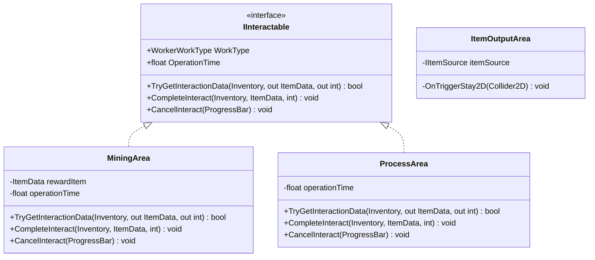

# Alanlar & Dünya Etkileşimleri (Areas & World Interactions)

Mining Tycoon projesinde oyuncunun ve işçilerin fiziksel dünyada etkileşime girdiği tetikleyici bölgeleri (maden alanları, işleme istasyonları ve bina eşya çıkış alanları) tanımlar.

---

## Sistem Mimarisi

Alanlar iki temel kategoriye ayrılır:
1. **Zamanlı Etkileşim Alanları (`IInteractable`):** Oyuncunun veya işçinin belirli bir süre bekleyerek/basılı tutarak işlem yaptığı bölgeler (`MiningArea`, `ProcessArea`).
2. **Otomatik Çıkış Alanları:** Üzerine basıldığında anında veya durulduğu sürece depodaki ürünleri aktaran bölgeler (`ItemOutputArea`).



---

## Bileşenler ve Sorumluluklar

### 1. `MiningArea.cs` (Maden Çıkarma Alanı)
Sahnedeki maden düğümlerini temsil eder. `IInteractable` arayüzünü uygular.

* **Sorumlulukları:**
  * `rewardItem`: Bu madenden çıkacak cevher verisi (`ItemData`).
  * `operationTime`: Madenin kazılma süresi (varsayılan: 2 saniye).
  * `TryGetInteractionData`: Gelen envanterin bu ödül eşyayı kabul edip edemeyeceğini (`inventory.CanAccept`) doğrular.
  * `CompleteInteract`: Süre dolduğunda madeni aktörün envanterine ekler (`inventory.AddItem`).
* **Önemli İyileştirme:**
  * Downcasting tamamen kaldırılmıştır. Oyuncu veya işçi fark etmeksizin ortak `Inventory` sözleşmesiyle çalışır.

---

### 2. `ProcessArea.cs` (Manuel İşleme Alanı)
Ham maddelerin el ile işlenerek mamul ürünlere dönüştürüldüğü atölye bölgesidir.

* **Sorumlulukları:**
  * `TryGetInteractionData`:
    * **Oyuncu için:** Seçili hotbar slotundaki eşyanın işlenebilirliğini (`processable`) ve çıkan ödül eşyanın (`rewardItem`) envantere sığıp sığmayacağını kontrol eder (eşya kaybolma koruması).
    * **İşçi için:** İşçinin `InputItems` haznesini tarar; işlenebilir bir ham madde ve çıktı haznesinde yer varsa işlemi onaylar.
  * `CompleteInteract`: Girdi ham maddeyi siler (`RemoveItem`), dönüştürülen ürünü ekler (`AddItem`).

---

### 3. `ItemOutputArea.cs` (Bina Çıkış Alanı — Eski `CollectItem`)
Binaların (`AutoMiner`, `AutoProcessor`) önünde yer alan tetikleyici kutudur.

* **Sorumlulukları:**
  * Üzerine basan aktörün türünü tespit eder (`Player` veya `WorkerState.Transporting`).
  * Bağlı olduğu binanın `IItemSource.CollectItems()` metodunu çağırarak depodaki ürünleri aktörün envanterine yükler.
* **Sağladığı Fayda:**
  * Eski `CollectItem` sadece oyuncuyu kabul edip işçileri dışlıyordu. Yenilenen `ItemOutputArea`, taşıyıcı işçileri de kabul ederek binalardan eşya çekme sorumluluğunu tek bir merkezde toplar.

---

## Etkileşim Akış Diyagramı

```mermaid
sequenceDiagram
    autonumber
    actor Actor as Oyuncu / Taşıyıcı İşçi
    participant Area as ItemOutputArea
    participant Building as IItemSource (Bina)

    Actor->>Area: Alana Adım At (OnTriggerStay2D)
    alt Oyuncu ise
        Area->>Building: CollectItems(PlayerInventory)
    else Taşıyıcı İşçi ise
        Area->>Building: CollectItems(WorkerInventory)
    end
    Building-->>Actor: Ürünler Envantere Aktarılır
```
