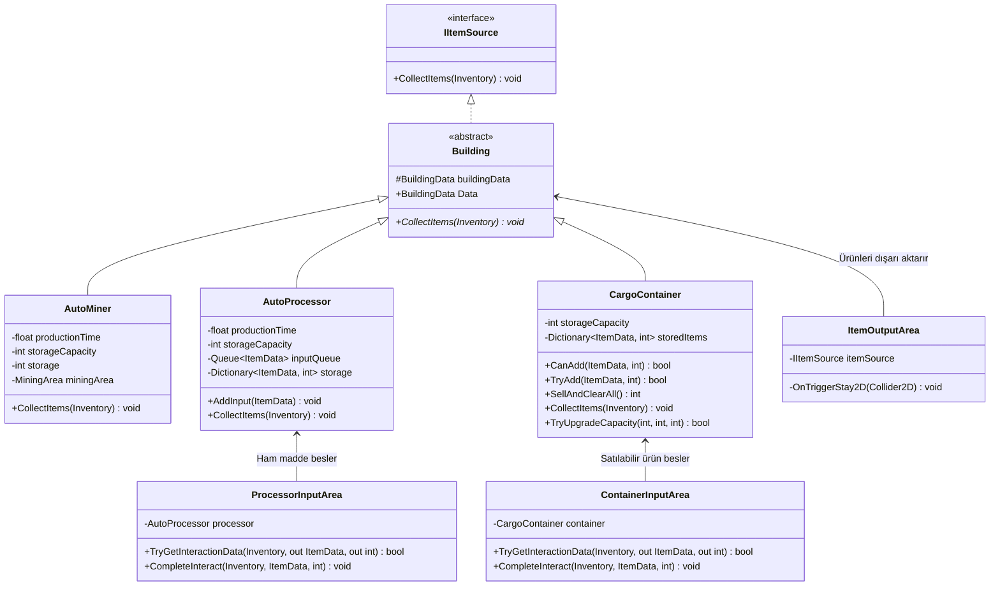
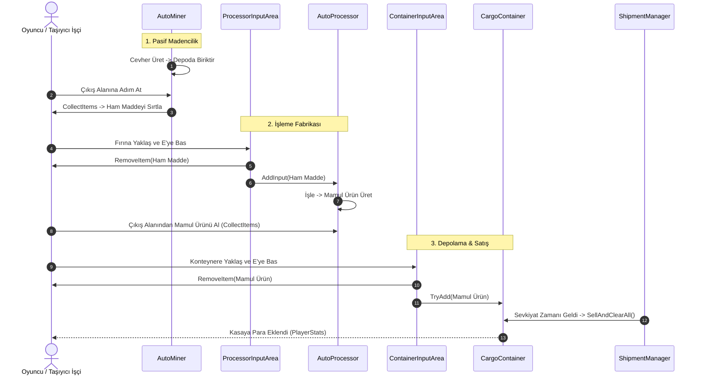

# Bina Sistemi (Building System)

Mining Tycoon projesinde otomatik üretimi, işlemeyi ve depolamayı sağlayan binaları (`AutoMiner`, `AutoProcessor`, `CargoContainer`) ve bu binaların girdi/çıktı etkileşim alanlarını yöneten sistemdir.

---

## Sistem Mimarisi

Tüm binalar `Building` abstract temel sınıfından türemiştir ve `IItemSource` sözleşmesini uygulayarak envanterlere (oyuncu veya işçi) polimorfik olarak ürün aktarabilir.

---

## Bileşenler ve Sorumluluklar

### 1. `BuildingData.cs` (Bina Veri Nesnesi)
Bir binanın satın alma, yerleştirme ve prefab konfigürasyonunu tutan ScriptableObject'tir (`InventoryObject` türevidir).
* `price`: Binanın satın alma maliyeti.
* `buildingPrefab`: Sahneye dikilecek gerçek bina prefabı.
* `ghostPrefab`: Yerleştirme önizlemesi sırasında fareyi takip eden yarı saydam prefab.
* `size`: Grid üzerindeki hücre kaplama boyutu (örn: 2x2).
* `placementBlockerLayer`: Üzerine bina dikilmesini engelleyen katmanlar.
* `fineLayer`: Madenci binasının altındaki madeni bulmak için kullandığı kaynak algılama katmanı.

---

### 2. `Building.cs` (Temel Soyutlama — Layer Supertype)
Tüm binaların ortak atasıdır.
* `Data`: Binaya ait `BuildingData` referansını dışarıya sunar.
* `CollectItems(Inventory inventory)`: Alt sınıfların depoladıkları eşyaları bir aktörün envanterine vermesini zorunlu kılar.

---

### 3. `AutoMiner.cs` (Otomatik Madenci)
Bir `MiningArea` üzerine yerleştirilir. Zamana bağlı olarak otomatik maden kazar ve deposunda biriktirir.
* **Üretim Döngüsü:** Altındaki madeni `Physics2D.OverlapBox` ile bulur. Depo kapasitesi (`storageCapacity`) dolana kadar her `productionTime` saniyede 1 maden üretir. Depo dolduğunda üretim sayacı durur.
* **Kayıpsız Toplama (`CollectItems`):** Gelen envanterin kabul edip edemeyeceğini (`inventory.CanAccept`) sorgular. Ne kadar eşya eklenebildiyse (`int added = inventory.AddItem(...)`) depodan sadece o kadarını düşer.

---

### 4. `AutoProcessor.cs` (Otomatik Fırın / İşlemci)
Ham maddeleri sırayla işleyip mamul ürünlere (örn: Kömür -> İşlenmiş Kömür) dönüştürür.
* **Kuyruk Sistemi (`inputQueue`):** Ham maddeler kuyruğa eklenir (`AddInput`).
* **İşleme:** Kuyruktan sıradaki eşya çekilir (`currentItem`), `productionTime` süresi sonunda mamul ürünü (`rewardItem`) kendi `storage` sözlüğüne ekler.
* **Event Odaklı:** UI'ın verimli çalışabilmesi için `InputQueueChanged`, `CurrentItemChanged`, `StorageChanged` event'lerini ateşler.
* **Modüler `CollectItems`:** Depodaki ürünleri tek tek gezer; oyuncu veya taşıyıcı işçi hangisini alabiliyorsa sadece onu aktarır.

---

### 5. `ProcessorInputArea.cs` (İşlemci Giriş Alanı)
`AutoProcessor` prefabının bir alt nesnesidir (`IInteractable`).
* **Akıcı Aktarım:** `operationTime` (0.15s) aralıklarla eşyaları seri şekilde fırına aktarır.
* **Güvenli Transfer:** Önce aktörün envanterinden ham madde eksiltilir, eksiltme başarılıysa fırına `processor.AddInput(item)` çağrısıyla iletilir.

---

### 6. `CargoContainer.cs` (Kargo Konteyneri)
Satılabilir ürünlerin depolandığı ve sevkiyat gemisi geldiğinde topluca satıldığı binadır.
* **3 Eşya Türü Limiti:** En fazla 3 farklı çeşit satılabilir ürün depolayabilir (`MAX_ITEM_TYPES = 3`).
* **Sevkiyat Entegrasyonu:** `OnEnable` ile `ShipmentManager`'a kendini kaydeder. Gemi geldiğinde `SellAndClearAll()` çağrılır; toplam para hesaplanıp depodaki ürünler sıfırlanır.
* **Kapasite Yükseltme (`TryUpgradeCapacity`):** `PlayerStats.Instance.TrySpendMoney(cost)` ile oyuncunun parasını kontrol edip güvenle kapasitesini artırır.

---

### 7. `ContainerInputArea.cs` (Konteyner Giriş Alanı)
`CargoContainer` prefabının alt nesnesidir (`IInteractable`).
* Oyuncunun elindeki veya operatör işçinin çantasındaki satılabilir mamul ürünleri konteynere hızlıca aktarır.

---

## Malzeme Akış Diyagramı (Production & Logistics Lifecycle)

