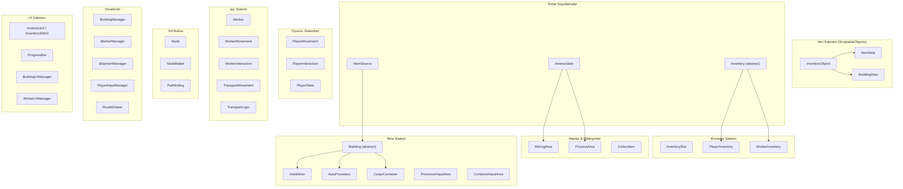

# Kod İnceleme & Dokümantasyon Planı

Mining Tycoon kod tabanının tamamını sistematik, aşağıdan yukarıya doğru inceleyen kapsamlı bir yol haritası. Bu planı takip etmek bana (ve ekibe yeni katılacak herkese) her sistemin, bağımlılıklarının, bilinen sorunlarının ve optimizasyon fırsatlarının tam hakimiyetini kazandıracaktır.

> [!IMPORTANT]
> **Bu plan nasıl kullanılır:** Fazları sırayla takip et. Her faz bir öncekinin üzerine inşa edilir. Her script için şunları yapacağız:
> 1. Kodu birlikte satır satır okumak
> 2. Ne yaptığını ve neden böyle yapıldığını tartışmak
> 3. Optimizasyon ve okunabilirlik iyileştirmelerini belirlemek
> 4. XML doc comment'leri ve satır içi açıklamalar eklemek
> 5. İlgili dokümantasyon `.md` dosyasını güncellemek/oluşturmak

---

## Proje Genel Bakış

```text
Mining Tycoon — 2D Yukarıdan Görünüm Idle/Tycoon Oyunu (Unity 6, URP 2D)

Ana Döngü:
  Oyuncu maden kazır → İşlenmiş ürüne dönüştürür → Konteynerlerde depolar → Sevkiyatla para kazanır
  İşçiler otomatikleştirir: Madencilik → İşleme → Makine Operasyonu → İşçiler arası Taşıma
  Binalar otomatikleştirir: AutoMiner (pasif madencilik) → AutoProcessor (pasif işleme)
  Ekonomi: Ürün sat → Para kazan → İşçileri ve binaları geliştir → Üretimi ölçekle
```

### Mimari Diyagram



### Dosya Haritası (47 Script)

| # | Faz | Script | Yol |
|---|-----|--------|-----|
| 1 | 1 | `InventoryObject` | `Assets/ScriptableObjects/InventoryObject.cs` |
| 2 | 1 | `ItemData` | `Assets/ScriptableObjects/Items/ItemData.cs` |
| 3 | 1 | `BuildingData` | `Assets/ScriptableObjects/Buildings/BuildingData.cs` |
| 4 | 2 | `IInteractable` | `Assets/Scripts/Interactable.cs` |
| 5 | 2 | `IItemSource` | `Assets/Scripts/IItemSource.cs` |
| 6 | 2 | `Inventory` | `Assets/Scripts/Inventory/Inventory.cs` |
| 7 | 3 | `InventorySlot` | `Assets/Scripts/Inventory/InventorySlot.cs` |
| 8 | 3 | `PlayerInventory` | `Assets/Scripts/Inventory/PlayerInventory.cs` |
| 9 | 3 | `WorkerInventory` | `Assets/Scripts/Inventory/WorkerInventory.cs` |
| 10 | 4 | `PlayerMovement` | `Assets/Scripts/Player/PlayerMovement.cs` |
| 11 | 4 | `PlayerInteraction` | `Assets/Scripts/Player/PlayerInteraction.cs` |
| 12 | 4 | `PlayerStats` | `Assets/Scripts/Player/PlayerStats.cs` |
| 13 | 5 | `MiningArea` | `Assets/Scripts/Areas/MiningArea.cs` |
| 14 | 5 | `ProcessArea` | `Assets/Scripts/Areas/ProcessArea.cs` |
| 15 | 5 | `CollectItem` | `Assets/Scripts/CollectItem.cs` |
| 16 | 6 | `Building` | `Assets/Scripts/Building/Building.cs` |
| 17 | 6 | `AutoMiner` | `Assets/Scripts/Building/Miner/AutoMiner.cs` |
| 18 | 6 | `AutoProcessor` | `Assets/Scripts/Building/Processor/AutoProcessor.cs` |
| 19 | 6 | `ProcessorInputArea` | `Assets/Scripts/Building/Processor/ProcessInputArea.cs` |
| 20 | 6 | `CargoContainer` | `Assets/Scripts/Building/Container/CargoContainer.cs` |
| 21 | 6 | `ContainerInputArea` | `Assets/Scripts/Building/Container/ContainerInputArea.cs` |
| 22 | 7 | `Node` | `Assets/Scripts/PathFinding/Node.cs` |
| 23 | 7 | `NodeMaker` | `Assets/Scripts/PathFinding/NodeMaker.cs` |
| 24 | 7 | `Pathfinding` | `Assets/Scripts/PathFinding/PathFinding.cs` |
| 25 | 8 | `Worker` | `Assets/Scripts/Worker/Worker.cs` |
| 26 | 8 | `WorkerMovement` | `Assets/Scripts/Worker/WorkerMovement.cs` |
| 27 | 8 | `WorkerInteraction` | `Assets/Scripts/Worker/WorkerInteraction.cs` |
| 28 | 8 | `TransportMovement` | `Assets/Scripts/Worker/TransportMovement.cs` |
| 29 | 8 | `TransportLogic` | `Assets/Scripts/Worker/TransportLogic.cs` |
| 30 | 9 | `PlayerInputManager` | `Assets/Scripts/Managers/PlayerClickManager.cs` |
| 31 | 9 | `BuildingManager` | `Assets/Scripts/Managers/BuildingManager.cs` |
| 32 | 9 | `WorkerManager` | `Assets/Scripts/Managers/WorkerManager.cs` |
| 33 | 9 | `ShipmentManager` | `Assets/Scripts/Managers/ShipmentManager.cs` |
| 34 | 9 | `RouteDrawer` | `Assets/Scripts/Managers/RouteDrawer.cs` |
| 35 | 10 | `ProgressBar` | `Assets/Scripts/UI/ProgressBar.cs` |
| 36 | 10 | `InventorySlotUI` | `Assets/Scripts/UI/InventorySlotUI.cs` |
| 37 | 10 | `InventoryUI` | `Assets/Scripts/UI/InventoryUI.cs` |
| 38 | 10 | `BuildingUIManager` | `Assets/Scripts/UI/BuildingUI/BuildingUIManager.cs` |
| 39 | 10 | `MinerPanelUI` | `Assets/Scripts/UI/BuildingUI/MinerPanelUI.cs` |
| 40 | 10 | `ProcessorPanelUI` | `Assets/Scripts/UI/BuildingUI/ProcessorPanelUI.cs` |
| 41 | 10 | `ContainerPanelUI` | `Assets/Scripts/UI/BuildingUI/ContainerPanelUI.cs` |
| 42 | 10 | `WorkerUIManager` | `Assets/Scripts/UI/WorkerUI/WorkerUIManager.cs` |
| 43 | 10 | `AssignTaskPanelUI` | `Assets/Scripts/UI/WorkerUI/AssignTaskPanelUI.cs` |
| 44 | 10 | `MiningWorkerPanelUI` | `Assets/Scripts/UI/WorkerUI/MiningWorkerPanelUI.cs` |
| 45 | 10 | `OperatingWorkerPanelUI` | `Assets/Scripts/UI/WorkerUI/OperatingWorkerPanelUI.cs` |
| 46 | 10 | `ProcessingWorkerPanelUI` | `Assets/Scripts/UI/WorkerUI/ProcessingWorkerPanelUI.cs` |
| 47 | 10 | `TransportingWorkerPanelUI` | `Assets/Scripts/UI/WorkerUI/TransportingWorkerPanelUI.cs` |

---

## Faz 1 — Veri Katmanı (ScriptableObjects)

> **Hedef:** Her şeyin üzerine inşa edildiği veri temelini anlamak.
> **Neden buradan başlıyoruz:** Oyundaki her sistem bu veri nesnelerine referans verir. Envanter, binalar veya işçileri, üzerinde çalıştıkları verileri anlamadan kavrayamazsın.

### İncelenecek Script'ler

#### 1. [InventoryObject.cs](file:///Users/bartug/Mining%20Tycoon/Assets/ScriptableObjects/InventoryObject.cs)

**Ne olduğu:** Abstract temel `ScriptableObject` — envanterde var olabilecek her şeyin (item'lar VE binalar) kök tipi.

**İnceleme kontrol listesi:**
- [x] Sınıfı oku ve `objectName` ile `icon` alanlarını anla
- [x] Neden `abstract` olduğunu anla — doğrudan asla örneklenmez (instantiate edilmez)
- [x] Flyweight pattern'ini anla: tek bir SO asset'i tüm referanslar tarafından paylaşılır
- [x] Not: alanlar property olmadan `public` — kapsüllemeyi tartış

**Tartışılacak bilinen sorunlar:**
- `[field: SerializeField] public string ObjectName { get; private set; }` yerine doğrudan public alanlar kullanılmış
- Doğrulama yok (boş isim, null ikon)

---

#### 2. [ItemData.cs](file:///Users/bartug/Mining%20Tycoon/Assets/ScriptableObjects/Items/ItemData.cs)

**Ne olduğu:** Somut item tanımı — ham cevherler, işlenmiş ürünler. Satış fiyatı, işlenebilirlik bayrağı ve 1:1 tarif bağlantısı (`rewardItem`) içerir.

**İnceleme kontrol listesi:**
- [x] Her alanı oku: `sellPrice`, `sellable`, `processable`, `rewardItem`
- [x] Unity'de gerçek `.asset` dosyalarını aç ve verileri takip et: `rawCoal → processedCoal`, `rawGold → processedGold`, `rawDiamond → processedDiamond`
- [x] Kendine referans veren tarif yapısını anla: `ItemData.rewardItem` başka bir `ItemData`'ya işaret eder
- [x] Kısıtlamayı tartış: sadece 1:1 tarifler (1 girdi → 1 çıktı, miktar 1)

**Tartışılacak bilinen sorunlar:**
- Katı tarif modeli — çoklu girdi veya çoklu çıktı tariflerini destekleyemez
- Miktar alanı yok (her zaman 1:1 varsayar)
- `processable = true` olsa bile `rewardItem` `null` olabilir — editör doğrulaması yok

---

#### 3. [BuildingData.cs](file:///Users/bartug/Mining%20Tycoon/Assets/ScriptableObjects/Buildings/BuildingData.cs)

**Ne olduğu:** Yerleştirilebilir binaların konfigürasyonu — maliyet, prefab'lar, grid boyutu, yerleştirme kuralları.

**İnceleme kontrol listesi:**
- [x] Her alanı oku: `price`, `buildingPrefab`, `ghostPrefab`, `size`, `placementBlockerLayer`, `fineLayer`
- [x] `.asset` dosyalarını aç: `Miner.asset`, `Processer.asset`, `Container.asset`
- [x] `fineLayer`'ı anla — `AutoMiner` tarafından overlap ile `MiningArea` collider'larını tespit etmek için kullanılır
- [x] Ghost/gerçek prefab ayrımını yerleştirme önizlemesi için anla

**Tartışılacak bilinen sorunlar:**
- `fineLayer` kafa karıştırıcı bir isim — `requiredResourceLayer` veya `resourceDetectionLayer` olmalı
- Asset isminde yazım hatası: `Processer.asset` → `Processor.asset` olmalı
- `Processer` vs `Processor` tutarsızlığı kafa karışıklığına yol açabilir

**Dokümantasyon çıktısı:**
- [x] 3 ScriptableObject sınıfına XML doc comment'leri ekle
- [x] `Assets/Documentation/Building.md`'deki BuildingData bölümünü Türkçe güncelle

---

## Faz 2 — Temel Arayüzler & Soyutlamalar

> **Hedef:** Tüm sistemleri birbirine bağlayan kontratları anlamak.
> **Neden şimdi:** Implementasyonlara dalmadan önce, uyguladıkları kuralları bilmen gerekiyor.

### İncelenecek Script'ler

#### 4. [IInteractable (Interactable.cs)](file:///Users/bartug/Mining%20Tycoon/Assets/Scripts/Interactable.cs)

**Ne olduğu:** Zamanlı etkileşimin yaşam döngüsünü tanımlayan arayüz: doğrula → ilerleme → tamamla veya iptal et.

**İnceleme kontrol listesi:**
- [x] Her üyeyi oku: `WorkType`, `OperationTime`, `TryGetInteractionData()`, `CompleteInteract()`, `CancelInteract()`
- [x] Kimin implement ettiğini takip et: `MiningArea`, `ProcessArea`, `ContainerInputArea`, `ProcessorInputArea`
- [x] Kimin çağırdığını takip et: `PlayerInteraction`, `WorkerInteraction`
- [x] Doğrulama → yürütme → iptal yaşam döngüsünü anla

**Tartışılacak bilinen sorunlar:**
- `CancelInteract(ProgressBar progress)` — UI tipi (`ProgressBar`) domain arayüzüne sızmış
- Arayüzdeki `WorkerWorkType` — oyuncu etkileşimleri için de kullanılan işçiye özgü terminoloji
- Düşün: `CancelInteract` parametresiz olmalı ve UI'ı çağıran mı yönetmeli?

---

#### 5. [IItemSource.cs](file:///Users/bartug/Mining%20Tycoon/Assets/Scripts/IItemSource.cs)

**Ne olduğu:** Bir envantere item verebilen her şey için arayüz (binalar, işçiler).

**İnceleme kontrol listesi:**
- [x] Tek metodu oku: `CollectItems(Inventory targetInventory)`
- [x] Kimin implement ettiğini takip et: `Building` (→ `AutoMiner`, `AutoProcessor`, `CargoContainer`), `Worker`
- [x] Kimin çağırdığını takip et: `CollectItem.cs`, `TransportLogic.cs`

**Tartışılacak bilinen sorunlar:**
- Implement edenler downcast yapıyor: `if (inventory is PlayerInventory)` — polimorfizmi bozuyor
- `Inventory` parametresi çok genel — implement edenler somut tipi bilmek zorunda kalıyor

---

#### 6. [Inventory.cs](file:///Users/bartug/Mining%20Tycoon/Assets/Scripts/Inventory/Inventory.cs)

**Ne olduğu:** Tüm envanter tipleri için abstract temel sınıf. Şu anda **tamamen boş** — paylaşılan metot veya durum yok.

**İnceleme kontrol listesi:**
- [x] Sınıfı oku — sadece `public abstract class Inventory : MonoBehaviour { }`
- [x] Neden var olduğunu anla: `IItemSource.CollectItems(Inventory)` metodunun hem oyuncu hem işçiyi kabul etmesini sağlar
- [x] Tartış: bu bir "anemik temel sınıf" — paylaşılan hiçbir kontrat sağlamıyor

**Tartışılacak bilinen sorunlar:**
- Paylaşılan `AddItem()`, `RemoveItem()`, `HasItem()` veya `CanAccept()` metotları yok
- Bu durum her tüketiciyi `PlayerInventory` veya `WorkerInventory`'ye downcast etmeye zorluyor
- Buraya paylaşılan abstract metotlar eklemek kod tabanındaki downcast'lerin %90'ını ortadan kaldırır

**Dokümantasyon çıktısı:**
- [x] `Assets/Documentation/CoreInterfaces.md` oluştur — `IInteractable`, `IItemSource` ve `Inventory`'yi belgele

---

## Faz 3 — Envanter Sistemi

> **Hedef:** Item'ların nasıl depolandığını, takip edildiğini ve transfer edildiğini anlamak.
> **Neden şimdi:** Her oyun sistemi envanterden okur/yazar. Bu, verinin omurgasıdır.

### İncelenecek Script'ler

#### 7. [InventorySlot.cs](file:///Users/bartug/Mining%20Tycoon/Assets/Scripts/Inventory/InventorySlot.cs)

**Ne olduğu:** Saf C# veri sınıfı — bir `InventoryObject` referansı ve yığın sayısı tutan tek bir slot.

**İnceleme kontrol listesi:**
- [ ] Oku: `Data`, `Amount`, `Clear()`, `AddAmount()`, `RemoveAmount()`, `SetItem()`
- [ ] Kapsüllemeyi anla: private setter'lar, public metotlar
- [ ] Not: bu bir MonoBehaviour DEĞİL — düz bir veri nesnesi

**Tartışılacak bilinen sorunlar:**
- `RemoveAmount()`'ta negatif miktar koruması yok
- `AddAmount()`'ta maksimum yığın limiti doğrulaması yok
- `RemoveAmount()` miktar 0'a ulaştığında otomatik temizleme yapmıyor
- `SetItem()` ve `AddAmount()` bağımsız çağrılabilir → senkronizasyon bozulma riski

---

#### 8. [PlayerInventory.cs](file:///Users/bartug/Mining%20Tycoon/Assets/Scripts/Inventory/PlayerInventory.cs)

**Ne olduğu:** Oyuncunun 8 slotluk hotbar'ını yöneten Singleton. Item ekleme, çıkarma, seçme ve değişiklik event'lerini ateşleme işlemlerini yürütür.

**İnceleme kontrol listesi:**
- [ ] `Awake()`'teki Singleton pattern'ini oku
- [ ] `AddItem()`'ı oku — yığınlama vs. boş slot bulma mantığını anla
- [ ] `RemoveItem()`'ı oku — tek slot araması kısıtlamasını anla
- [ ] `GetSelectedItem()`, `SelectSlot()` — hotbar seçimini oku
- [ ] Event'leri oku: `SelectedSlotChanged`, `InventoryChanged`
- [ ] Bu event'leri kimin dinlediğini takip et

**Tartışılacak bilinen sorunlar:**
- **Çoklu yığın hatası:** `AddItem` taşsa bile ilk eşleşen slotta durur; `RemoveItem` ve `HasItem` sadece tek bir slotu kontrol eder
- `GetSlots()` dahili diziyi döndürüyor — dış kod `InventoryChanged` tetiklemeden değiştirebilir
- Kodda Türkçe debug mesajı: `"o kadar item yok"` → kaldırılmalı veya İngilizce olmalı
- Slot sayısı sabiti yok — `8` sihirli sayı

---

#### 9. [WorkerInventory.cs](file:///Users/bartug/Mining%20Tycoon/Assets/Scripts/Inventory/WorkerInventory.cs)

**Ne olduğu:** İşçiler için çift tamponlu envanter (Girdi + Çıktı). Kapasite, işçinin mevcut görev türüne göre dinamik olarak hesaplanır.

**İnceleme kontrol listesi:**
- [ ] Çift dictionary tasarımını oku: `inputItems` ve `outputItems`
- [ ] Kapasite hesaplamasını oku: `MaxInputCapacity` ve `MaxOutputCapacity` → `WorkerWorkType` üzerinden switch
- [ ] `CanAddToInput()` / `CanAddToOutput()` — 3 item tipi limiti, kapasite kontrolü
- [ ] Transfer metotlarını oku: `TransferAllToPlayer()`, `TransferToInputOf()`, `TransferFromOutputOf()`
- [ ] Event'leri oku: `OnInputChanged`, `OnOutputChanged`

**Tartışılacak bilinen sorunlar:**
- `InputItems` ve `OutputItems` property'leri değiştirilebilir dictionary'leri açığa çıkarıyor — `IReadOnlyDictionary` döndürmeli
- İkisi de `Inventory`'den miras almasına rağmen `PlayerInventory` ile sıfır ortak arayüz paylaşıyor
- Kapasite hesaplaması için `Worker` bileşenine sıkı bağımlılık

**Dokümantasyon çıktısı:**
- [ ] `Assets/Documentation/Inventory.md`'yi güncelle — Türkçe yeniden yaz, WorkerInventory bölümü ekle, bağımlılık diyagramı ekle

---

## Faz 4 — Oyuncu Sistemleri

> **Hedef:** Oyuncunun nasıl hareket ettiğini, etkileşime girdiğini ve kaynakları yönettiğini anlamak.
> **Neden şimdi:** Oyuncu birincil aktördür. Oyuncu sistemlerini anlamak, (onları yansıtan) işçi sistemlerini çok daha netleştirir.

### İncelenecek Script'ler

#### 10. [PlayerMovement.cs](file:///Users/bartug/Mining%20Tycoon/Assets/Scripts/Player/PlayerMovement.cs)

**Ne olduğu:** Rigidbody2D ile standart 2D yukarıdan görünüm hareketi. `Update()`'te girdi toplama, `FixedUpdate()`'te fizik uygulama.

**İnceleme kontrol listesi:**
- [ ] `Update()`'teki girdi toplamayı oku — `GetAxisRaw("Horizontal")`, `GetAxisRaw("Vertical")`
- [ ] `FixedUpdate()`'teki fiziği oku — `rb.linearVelocity` (Unity 6 API'si)
- [ ] Sprite çevirme mantığını oku
- [ ] `EnableMovement()` / `DisableMovement()` — etkileşimler sırasında kullanılır

**Tartışılacak bilinen sorunlar:**
- Temiz ve iyi yapılandırılmış — diğer script'ler için iyi bir referans
- Unity 6'nın `linearVelocity`'sini kullanıyor (kullanımdan kaldırılan `velocity` değil)

---

#### 11. [PlayerInteraction.cs](file:///Users/bartug/Mining%20Tycoon/Assets/Scripts/Player/PlayerInteraction.cs)

**Ne olduğu:** Oyuncunun yakınlık trigger'larını, basılı tutarak etkileşim kanallamasını ve işçi item transfer kısayollarını yöneten Singleton.

**İnceleme kontrol listesi:**
- [ ] Trigger algılamayı oku: `IInteractable` ve `Worker` için `OnTriggerEnter2D` / `OnTriggerExit2D`
- [ ] `Update()`'teki E basılı tutma etkileşim döngüsünü oku: zamanlayıcı → ilerleme çubuğu → tamamla
- [ ] İşçi kısayollarını oku: F = item ver, R = item'ları geri al
- [ ] Etkileşimler sırasında hareketin devre dışı/aktif edilmesini oku
- [ ] Event'i anla: `OnNearbyWorkerChanged`

**Tartışılacak bilinen sorunlar:**
- **God class:** Çevre etkileşimlerini, işçi envanter kısayollarını VE debug tuşlarını (`P` ile para) tek bir script'te yönetiyor
- **Trigger üzerine yazma hatası:** İki `IInteractable` collider'ı çakışırsa, ikincisine girmek birincisini iptal etmeden `currentInteractable`'ı üzerine yazar
- Karma erişim kalıpları: serileştirilmiş `PlayerInventory` alanı vs `PlayerStats.Instance` singleton

---

#### 12. [PlayerStats.cs](file:///Users/bartug/Mining%20Tycoon/Assets/Scripts/Player/PlayerStats.cs)

**Ne olduğu:** Oyuncu parasını depolayan Singleton. Para ekleme/çıkarma metotları.

**İnceleme kontrol listesi:**
- [ ] Singleton pattern'ini oku
- [ ] `GetPlayerMoney()`, `AddMoney()`, `RemoveMoney()` metotlarını oku
- [ ] Kullanılmayan `operationTimer` / `PlayerTimer` alanlarını bul

**Tartışılacak bilinen sorunlar:**
- **Ölü kod:** `operationTimer` ve `PlayerTimer` hiçbir zaman kullanılmıyor
- **Event yok:** `OnMoneyChanged` event'i yok — UI, polling olmadan para değişikliklerine tepki veremiyor
- **Doğrulama yok:** `RemoveMoney()` negatif bakiyeye izin veriyor
- Stil: `GetPlayerMoney()` bir property olmalı → `Money { get; }`

**Dokümantasyon çıktısı:**
- [ ] 3 oyuncu script'ini kapsayan `Assets/Documentation/Player.md` oluştur

---

## Faz 5 — Alanlar & Dünya Etkileşimleri

> **Hedef:** Dünyadaki etkileşim bölgelerinin nasıl çalıştığını anlamak — maden düğümleri, işleme istasyonları, toplama trigger'ları.
> **Neden şimdi:** Bunlar Faz 2'de incelediğin `IInteractable`'ın somut implementasyonları.

### İncelenecek Script'ler

#### 13. [MiningArea.cs](file:///Users/bartug/Mining%20Tycoon/Assets/Scripts/Areas/MiningArea.cs)

**Ne olduğu:** Bir maden düğümü. İçinde durup etkileşimi basılı tutmak, `operationTime` sonrasında `rewardItem` çıkarır.

**İnceleme kontrol listesi:**
- [ ] `TryGetInteractionData()` — oyuncu vs işçi için farklı doğrulamayı oku
- [ ] `CompleteInteract()` — item'ları oyuncu vs işçi envanterine nasıl eklediğini oku
- [ ] `CancelInteract()` — ilerleme çubuğu sıfırlamayı oku
- [ ] Not: `AutoMiner` bunu `Awake()`'inde `Physics2D.OverlapBox` ile tespit eder

**Tartışılacak bilinen sorunlar:**
- Downcasting: `if (inventory is PlayerInventory) ... else if (inventory is WorkerInventory) ...`
- Asimetrik doğrulama: işçi kapasitesi kontrol ediliyor, oyuncu kapasitesi kontrol EDİLMİYOR
- Yeni bir envanter tipi eklemek bu kodun değiştirilmesini gerektirir (OCP ihlali)

---

#### 14. [ProcessArea.cs](file:///Users/bartug/Mining%20Tycoon/Assets/Scripts/Areas/ProcessArea.cs)

**Ne olduğu:** Manuel işleme istasyonu. İşlenebilir bir item'ı tüketir ve onun `rewardItem`'ını üretir.

**İnceleme kontrol listesi:**
- [ ] `TryGetInteractionData()` — oyuncu seçili item'ı kullanır, işçi tüm girdi'leri tarar
- [ ] `CompleteInteract()` — girdiyi çıkarır, çıktıyı ekler
- [ ] `MiningArea` ile karşılaştır — aynı arayüz, farklı davranış

**Tartışılacak bilinen sorunlar:**
- Türkçe debug log: `"bu item islenemez"` → İngilizce olmalı
- `MiningArea` ile aynı downcasting kalıbı
- Oyuncu `rewardItem` için yer olup olmadığını kontrol etmeden girdiyi çıkarıyor

---

#### 15. [CollectItem.cs](file:///Users/bartug/Mining%20Tycoon/Assets/Scripts/CollectItem.cs)

**Ne olduğu:** Binalardaki trigger alanı. Oyuncu girdiğinde `IItemSource` aracılığıyla otomatik olarak item toplar.

**İnceleme kontrol listesi:**
- [ ] `Awake()` — üst nesnede `IItemSource` bulur
- [ ] `OnTriggerStay2D()` — `"Player"` etiketini kontrol eder, `CollectItems()` çağırır
- [ ] Not: `Enter` değil `Stay` kullanıyor — her fizik tick'inde ateşleniyor

**Tartışılacak bilinen sorunlar:**
- **Performans:** Trigger içindeyken her fizik tick'inde `GetComponent<Inventory>()` çağrılıyor
- `OnTriggerStay2D` israf — `OnTriggerEnter2D` + manuel toplama düşünülmeli
- Kodlanmış string etiket `"Player"` — kırılgan
- İşçiler bu trigger'ı kullanamıyor (sadece oyuncu)

**Dokümantasyon çıktısı:**
- [ ] `MiningArea`, `ProcessArea`, `CollectItem`'ı kapsayan `Assets/Documentation/Areas.md` oluştur

---

## Faz 6 — Bina Sistemi

> **Hedef:** Otomatik üretimi anlamak — madenciler, işlemciler, konteynerler ve girdi alanları.
> **Neden şimdi:** Binalar ana otomasyon katmanıdır. Şu ana kadar öğrendiğin her şeye bağımlıdırlar.

### İncelenecek Script'ler

#### 16. [Building.cs](file:///Users/bartug/Mining%20Tycoon/Assets/Scripts/Building/Building.cs)

**Ne olduğu:** Tüm binalar için abstract temel sınıf. `BuildingData`'ya bağlar ve `IItemSource`'u zorunlu kılar.

**İnceleme kontrol listesi:**
- [ ] Sınıfı oku: `buildingData` alanı, `Data` property'si, abstract `CollectItems()`
- [ ] Anla: bu "Layer Supertype" pattern'i — tüm bina tipleri için paylaşılan temel
- [ ] Not: çok minimal — ortak yaşam döngüsü kancaları (init, destroy callback'leri) yok

---

#### 17. [AutoMiner.cs](file:///Users/bartug/Mining%20Tycoon/Assets/Scripts/Building/Miner/AutoMiner.cs)

**Ne olduğu:** Bir `MiningArea` üzerine yerleştirilir, zamanlayıcıyla pasif olarak cevher çıkarır ve depolar.

**İnceleme kontrol listesi:**
- [ ] `Awake()` — altındaki `MiningArea`'yı bulmak için `Physics2D.OverlapBox` kullanır
- [ ] `Update()` — zamanlayıcı tabanlı üretim, depolama kapasitesi kontrolü
- [ ] `CollectItems()` — oyuncu hepsini alır, işçi transport item'ına göre filtrelenir
- [ ] `Progress`, `Status`, `StoredItemCount` property'lerini oku

**Tartışılacak bilinen sorunlar:**
- Kırılgan `Awake()` — collider'lar henüz kayıt olmadıysa overlap başarısız olur
- `Update()` depolama doluyken bile her karede zamanlayıcıyı çalıştırıyor — israf
- `CollectItems()` işçi iç yapısına derinlemesine erişiyor: `GetComponent<Worker>()`, `CurrentState` kontrol ediyor, `TransportLogic` sorguluyor

---

#### 18. [AutoProcessor.cs](file:///Users/bartug/Mining%20Tycoon/Assets/Scripts/Building/Processor/AutoProcessor.cs)

**Ne olduğu:** Kuyruk tabanlı işleme binası. Item'lar `inputQueue`'ya girer, birer birer işlenir, çıktı `storage`'a gider.

**İnceleme kontrol listesi:**
- [ ] Kuyruk sistemini oku: `inputQueue`, `currentItem`, `storage` dictionary'si
- [ ] `AddInput()` — kuyruğa ekler, envanterden çıkarır
- [ ] `Update()` — kuyruktan çıkar → zamanlayıcı → üret → depola
- [ ] 3 event'in hepsini oku: `InputQueueChanged`, `CurrentItemChanged`, `StorageChanged`
- [ ] `CollectItems()` — AutoMiner ile aynı oyuncu/işçi ayrımı

**Tartışılacak bilinen sorunlar:**
- `InputQueue` ve `Storage` değiştirilebilir koleksiyonları doğrudan açığa çıkarıyor
- `storageCapacity` GİRDİ kuyruğu için kontrol ediliyor ama ÇIKTI deposunun limiti yok
- AutoMiner ile aynı derin işçi bağımlılığı

---

#### 19. [ProcessorInputArea (ProcessInputArea.cs)](file:///Users/bartug/Mining%20Tycoon/Assets/Scripts/Building/Processor/ProcessInputArea.cs)

**Ne olduğu:** `AutoProcessor`'a item eklemek için etkileşim bölgesi. Hızlı tekrar zamanlaması (ilk 0.6s, tekrar 0.15s).

**İnceleme kontrol listesi:**
- [ ] Hızlı tekrar mekanizmasını oku: `firstInsertTime` vs `repeatInsertTime`
- [ ] `TryGetInteractionData()` — `InputQueue.Count`'a karşı kapasite kontrolü
- [ ] `CompleteInteract()` — `processor.AddInput()` çağırır
- [ ] Not: **dosya adı/sınıf adı uyuşmazlığı** — dosya `ProcessInputArea.cs`, sınıf `ProcessorInputArea`

**Tartışılacak bilinen sorunlar:**
- **Dosya/sınıf adı uyuşmazlığı** — dosya `ProcessorInputArea.cs` olarak yeniden adlandırılmalı
- Sadece `processable` kontrol ediyor ama `rewardItem != null` kontrol ETMİYOR
- `firstInsertDone` bileşen başına, aktör başına değil — birden fazla etkileşimci arasında paylaşılıyor

---

#### 20. [CargoContainer.cs](file:///Users/bartug/Mining%20Tycoon/Assets/Scripts/Building/Container/CargoContainer.cs)

**Ne olduğu:** Satılabilir ürünler için depolama binası. Maksimum 3 item tipi, periyodik satışlar için `ShipmentManager`'a kayıt olur.

**İnceleme kontrol listesi:**
- [ ] Depolamayı oku: `storedItems` dictionary'si, `MAX_ITEM_TYPES = 3`
- [ ] `CanAdd()` / `TryAdd()` — satılabilirlik kontrolü, tip limiti, kapasite kontrolü
- [ ] `SellAndClearAll()` — kazancı hesaplar, temizler, event ateşler
- [ ] `OnEnable()` / `OnDisable()` — `ShipmentManager`'a kendini kayıt/kayıttan çıkarma
- [ ] `TryUpgradeCapacity()` — varsayılan parametrelerde kodlanmış ekonomi değerleri

**Tartışılacak bilinen sorunlar:**
- `StoredItems` değiştirilebilir dictionary döndürüyor — `IReadOnlyDictionary` olmalı
- `TryUpgradeCapacity(cost = 500, amount = 10, maxLimit = 60)` içinde sihirli sayılar
- `CollectItems()` sadece oyuncu için çalışıyor, işçileri yok sayıyor

---

#### 21. [ContainerInputArea.cs](file:///Users/bartug/Mining%20Tycoon/Assets/Scripts/Building/Container/ContainerInputArea.cs)

**Ne olduğu:** Satılabilir item'ları `CargoContainer`'a yatırmak için etkileşim bölgesi. Aynı hızlı tekrar mekanizması.

**İnceleme kontrol listesi:**
- [ ] `TryGetInteractionData()` — oyuncu vs işçi item seçimini oku
- [ ] `CompleteInteract()` — `container.TryAdd()` sonra envanterden çıkar
- [ ] `ProcessorInputArea` ile karşılaştır — çok benzer kalıp

**Tartışılacak bilinen sorunlar:**
- `GetComponentInParent<CargoContainer>()` — hiyerarşi değişirse sessiz başarısızlık
- Aynı `firstInsertDone` paylaşılan durum sorunu
- Aynı downcasting kalıbı

**Dokümantasyon çıktısı:**
- [ ] `Assets/Documentation/Building.md`'yi tamamen Türkçe yeniden yaz
- [ ] Container ve InputArea bölümlerini ekle

---

## Faz 7 — Yol Bulma Sistemi

> **Hedef:** İşçilerin kullandığı A* navigasyon sistemini anlamak.
> **Neden şimdi:** İşçi hareketi tamamen yol bulmaya bağımlıdır. İşçilerden önce incele.

### İncelenecek Script'ler

#### 22. [Node.cs](file:///Users/bartug/Mining%20Tycoon/Assets/Scripts/PathFinding/Node.cs)

**Ne olduğu:** Navigasyon grafiğinde tek bir hücreyi temsil eden saf C# sınıfı. Pozisyon, yürünebilirlik ve yol maliyetlerini tutar.

**İnceleme kontrol listesi:**
- [ ] Oku: `isWalkable`, `gridPosition`, `gCost`, `hCost`, `FCost`, `parent`
- [ ] A* terminolojisini anla: g = başlangıçtan maliyet, h = hedefe sezgisel uzaklık, f = g + h
- [ ] Not: maliyetler ve parent, paylaşılan node üzerinde doğrudan depolanan değiştirilebilir durum

**Tartışılacak bilinen sorunlar:**
- **Graf düğümlerinde değiştirilebilir arama durumu** — birden fazla arama çalışırsa veri kirlenir
- Arama başına maliyetleri depolamak için ayrı bir "arama bağlamı" kullanılmalı

---

#### 23. [NodeMaker.cs](file:///Users/bartug/Mining%20Tycoon/Assets/Scripts/PathFinding/NodeMaker.cs)

**Ne olduğu:** Çarpışma `Tilemap`'inden navigasyon grid'ini oluşturur. Koordinat arama ve komşu sorguları sağlar.

**İnceleme kontrol listesi:**
- [ ] `Awake()` — tilemap sınırlarını dolaşır, her hücre için `Node` oluşturur
- [ ] `GetNode()`, `UpdateNodeWalkability()`, `GetNeighbors()` metotlarını oku
- [ ] Anla: binalar yerleştirildiğinde `UpdateNodeWalkability(false)` çağrılır

**Tartışılacak bilinen sorunlar:**
- **GC baskısı:** `GetNeighbors()` her çağrıda yeni `List<Node>` VE yeni `Vector3Int[]` ayırıyor
- Önceden ayırmak veya statik diziler kullanmak gerekir
- `gridNodes` `public` — kapsüllenmeli

---

#### 24. [Pathfinding.cs](file:///Users/bartug/Mining%20Tycoon/Assets/Scripts/PathFinding/PathFinding.cs)

**Ne olduğu:** A* arama algoritması. İki grid pozisyonu arasında en kısa yolu bulur.

**İnceleme kontrol listesi:**
- [ ] `FindPath()`'i adım adım oku — açık küme, kapalı küme, komşu genişletme
- [ ] `GetBestNode()` — en düşük FCost için doğrusal tarama
- [ ] `RetracePath()` — parent zincirini geriye doğru takip eder
- [ ] Sezgisel yöntemi oku: Manhattan mesafesi

> [!CAUTION]
> **Kritik Hata:** Yol bulucu, aramalar arasında `Node` nesnelerindeki `gCost`, `hCost` veya `parent` değerlerini ASLA sıfırlamıyor. Önceki aramalardan kalan eski veriler sonsuz döngülere, yanlış yollara veya başarısızlıklara neden olabilir.

**Tartışılacak bilinen sorunlar:**
- **KRİTİK:** Aramalar arasında node sıfırlaması yok — tüm node'lar temizlenmeli veya aramaya özel durum kullanılmalı
- **Performans:** `openSet` O(N) işlemlerle bir `List` — öncelik kuyruğu olmalı
- `openSet.Contains()` O(N) — eşlik eden bir `HashSet` kullanılmalı
- Tutarsız dönüş değerleri: geçersiz başlangıç/hedef için `null` vs yol bulunamadığında boş liste

**Dokümantasyon çıktısı:**
- [ ] `Assets/Documentation/PathFinding.md` oluştur — A* algoritmasını, bilinen hataları, performans notlarını açıkla

---

## Faz 8 — İşçi Sistemi

> **Hedef:** Otonom işçi yapay zekasını anlamak — durum makinesi, hareket, etkileşim ve taşıma.
> **Neden şimdi:** İşçiler en karmaşık sistemdir. Hareket, etkileşim, envanter ve yol bulmayı birleştirirler.

### İncelenecek Script'ler

#### 25. [Worker.cs](file:///Users/bartug/Mining%20Tycoon/Assets/Scripts/Worker/Worker.cs)

**Ne olduğu:** Merkezi işçi varlığı. Durumları (`Idle`, `Working`, `Transporting`), iş tiplerini (`Mining`, `Processing`, `Operating`, `Transporting`) tanımlar, tüm alt bileşenleri koordine eder, geliştirmeleri yönetir.

**İnceleme kontrol listesi:**
- [ ] Enum'ları oku: `WorkerState`, `WorkerWorkType`
- [ ] İstatistikleri oku: `name`, `level`, `miningSpeed`, `movementSpeed`, `carryCapacity`
- [ ] `Awake()` — tüm alt bileşenleri önbelleğe alır
- [ ] `Status` property'sini oku — karmaşık durum değerlendirmesi
- [ ] `StartTransporting()` — transport modunu başlatır
- [ ] `StopWorking()` — idle'a sıfırlar
- [ ] `CollectItems()` — `IItemSource` implementasyonu
- [ ] Geliştirme metotlarını oku: `TryUpgradeMiningSpeed()`, `TryUpgradeMovementSpeed()`

**Tartışılacak bilinen sorunlar:**
- **Derleyici uyarısı:** `[SerializeField] private string name` → `UnityEngine.Object.name`'i gizliyor
- God object eğilimi: kimlik + durum + envanter kaynağı + geliştirmeler tek sınıfta
- Varsayılan parametrelerde kodlanmış geliştirme maliyetleri (`500`) ve miktarları (`0.5f`)
- Geliştirmeler için doğrudan `PlayerStats.Instance` bağımlılığı

---

#### 26. [WorkerMovement.cs](file:///Users/bartug/Mining%20Tycoon/Assets/Scripts/Worker/WorkerMovement.cs)

**Ne olduğu:** Standart işçi görevleri için grid tabanlı yol bulma hareketi. Hücre çakışmasını önlemek için statik `OccupiedCells` kullanır.

**İnceleme kontrol listesi:**
- [ ] `MoveTo()` — doluluk kontrolü → yol bul → hücre talep et → harekete başla
- [ ] `Update()` — ara nokta ara nokta `MoveTowards`
- [ ] `StopMoving()`, `ReleaseClaim()` metotlarını oku
- [ ] Statik `OccupiedCells` — tüm işçiler arasında paylaşılır

> [!WARNING]
> **Kritik Hata:** `OccupiedCells` statik ve `OnDestroy()` veya sahne yeniden yüklemesinde ASLA temizlenmiyor. Bir işçi talep tutarken yok edilirse, o hücre kalıcı olarak kilitlenir.

**Tartışılacak bilinen sorunlar:**
- **KRİTİK:** `OnDestroy() { ReleaseClaim(); }` ekle ve sahne yüklemesinde temizle
- Atanmamış inspector referansları için `FindFirstObjectByType` yedek çözümü yok
- `TransportMovement` ile tekrarlanmış hareket mantığı

---

#### 27. [WorkerInteraction.cs](file:///Users/bartug/Mining%20Tycoon/Assets/Scripts/Worker/WorkerInteraction.cs)

**Ne olduğu:** Sürekli etkileşim sürücüsü. İşçi hedefe ulaştığında, `IInteractable` ile zamanlayıcı tabanlı etkileşim döngüsü başlatır.

**İnceleme kontrol listesi:**
- [ ] Trigger algılamayı oku: `IInteractable` için `OnTriggerEnter2D` / `OnTriggerExit2D`
- [ ] `Update()`'teki etkileşim döngüsünü oku: doğrula → zamanlayıcı → ilerleme → tamamla → tekrarla
- [ ] `isInteracting` bayrağını ve durum geçişlerini oku
- [ ] Bağımlılığı anla: hem trigger çakışması HEM DE `HasReachedTarget` gerektirir

**Tartışılacak bilinen sorunlar:**
- Kırılgan bağımlılık: trigger örtüşmesi VE `HasReachedTarget` gerektirir — yol bulma hedefi trigger sınırlarının biraz dışındaysa işçi sonsuza kadar takılır
- Her durum geçişinde sık `NotifyStatusChanged()` çağrıları

---

#### 28. [TransportMovement.cs](file:///Users/bartug/Mining%20Tycoon/Assets/Scripts/Worker/TransportMovement.cs)

**Ne olduğu:** Çizilen rota boyunca ping-pong devriye hareketi. Rota başlangıcına ulaşmak için isteğe bağlı yol bulma.

**İnceleme kontrol listesi:**
- [ ] `SetRoute()` — gerekirse başlangıca yol bul, sonra devriye başlat
- [ ] `Update()` — yol bulma düğümleri ile başlangıca git, sonra rota hücreleri ile devriye yap
- [ ] `AdvanceToNextWaypoint()` — uç noktalarda yön çevirme
- [ ] `StopPatrol()` — temizlik

**Tartışılacak bilinen sorunlar:**
- `WorkerMovement` ile tekrarlanmış `MoveTowards` mantığı
- Uç durum: 1 hücreli rota işçiyi boşta bırakır (hata yok, geri bildirim yok)
- `Awake()`'te `FindFirstObjectByType` ile otomatik kurtarma — `WorkerMovement` ile tutarsız

---

#### 29. [TransportLogic.cs](file:///Users/bartug/Mining%20Tycoon/Assets/Scripts/Worker/TransportLogic.cs)

**Ne olduğu:** Taşıma işçileri için trigger tabanlı item transfer mantığı. Kaynaklardan alır, diğer işçilere teslim eder.

**İnceleme kontrol listesi:**
- [ ] `OnTriggerEnter2D()` — çekirdek transfer mantığını oku
- [ ] Guard clause'ları oku: kendini atla, diğer taşımacıları atla, durumu kontrol et
- [ ] Teslim: `TransferToInputOf()` — item'ları diğer işçinin girdisine aktar
- [ ] Yükleme: `IItemSource` aracılığıyla `CollectItems()` — binalardan/işçilerden yükle
- [ ] `SetTransportItem()` / `ClearTransportItem()` metotlarını oku

**Tartışılacak bilinen sorunlar:**
- Fizik tabanlı transferler yüksek hızda veya tutarsız collider kurulumlarında ıskalanabilir
- Her trigger'da `GetComponentInParent<Worker>()` ve `GetComponentInParent<IItemSource>()` çağrılıyor — performans endişesi
- Transferlerde bekleme süresi veya hız sınırlaması yok

**Dokümantasyon çıktısı:**
- [ ] `Assets/Documentation/Worker.md` oluştur (şu anda boş) — İşçi durum makinesi, hareket, etkileşim, taşıma ve envanteri tam Türkçe belgele

---

## Faz 9 — Yönetici Sistemleri

> **Hedef:** Koordinasyon katmanını anlamak — girdi yönlendirme, bina yerleştirme, işçi gönderme, sevkiyat.
> **Neden şimdi:** Yöneticiler her şeyi orkestra eder. Önceki tüm sistemlere bağımlıdırlar.

### İncelenecek Script'ler

#### 30. [PlayerInputManager (PlayerClickManager.cs)](file:///Users/bartug/Mining%20Tycoon/Assets/Scripts/Managers/PlayerClickManager.cs)

**Ne olduğu:** Sol tık girdisini yakalar ve `WorkerManager` ile `BuildingManager`'a yönlendirir.

**İnceleme kontrol listesi:**
- [ ] `Update()` — tık algılama, ekrandan dünyaya koordinat dönüşümü
- [ ] Not: HER İKİ yöneticiyi de çağırır — tık tüketme / event baloncuklanması yok

> [!WARNING]
> **Dosya/Sınıf Uyuşmazlığı:** Dosya `PlayerClickManager.cs`, sınıf `PlayerInputManager`. Bu Unity uyarılarına ve karışıklığa neden olur.

**Tartışılacak bilinen sorunlar:**
- Sınıf adıyla eşleşmesi için **dosyayı** `PlayerInputManager.cs` **olarak yeniden adlandır**
- Her iki yönetici de her tıkı alıyor — öncelik sistemi veya tık tüketimi yok
- Her karede önbelleklenmemiş `Camera.main`
- Zaten içe aktarılan yeni Input System yerine eski Input sistemi kullanılıyor

---

#### 31. [BuildingManager.cs](file:///Users/bartug/Mining%20Tycoon/Assets/Scripts/Managers/BuildingManager.cs)

**Ne olduğu:** Envanterden bina seçimini, ghost önizlemeyi, yerleştirme doğrulamasını ve örneklemeyi yönetir.

**İnceleme kontrol listesi:**
- [ ] `Start()` — **not:** `Application.targetFrameRate = 120` ayarlar ve debug item'ları burada ekler
- [ ] Envanter event aboneliklerini oku: `SelectedSlotChanged`, `InventoryChanged`
- [ ] `SelectBuilding()` — ghost prefab oluşturur
- [ ] `Update()` → `MoveGhost()` → `CheckPlacement()` → `UpdateGhostColor()`
- [ ] `HandleLeftClick()` — bina yerleştir VEYA mevcut bina UI'ını aç
- [ ] `CancelPlacementMode()` — temizlik

**Tartışılacak bilinen sorunlar:**
- **Yanlış yerleştirilmiş sorumluluk:** `targetFrameRate` ve debug item ekleme bir oyun başlatma script'ine ait
- Fare hareket etmese bile `Update()`'te her karede `Physics2D.OverlapBox`
- `OnDestroy`'da eksik event abonelik iptali → bellek sızıntısı
- Önbelleklenmemiş `Camera.main`

---

#### 32. [WorkerManager.cs](file:///Users/bartug/Mining%20Tycoon/Assets/Scripts/Managers/WorkerManager.cs)

**Ne olduğu:** İşçi seçimini, iş atamasını ve transport rota oluşturmayı koordine eder.

**İnceleme kontrol listesi:**
- [ ] `HandleLeftClick()` — işçi seç VEYA iş hedefine ata
- [ ] `SetMoveWorkerMode()` — işçi yerleştirme moduna girer
- [ ] `SetTransportMode()` — transport yolu için `RouteDrawer` başlatır
- [ ] `OnRouteCompleted()` / `OnRouteCancelled()` — `RouteDrawer`'dan callback'ler

**Tartışılacak bilinen sorunlar:**
- Tutarsız alan adlandırması: `MoveWorkerMode` PascalCase (camelCase olmalı)
- Hem `TryMoveToWork` hem `OnRouteCompleted` içinde tekrarlanmış envanter boşaltma mantığı
- Kırılgan: MoveWorkerMode'da çalışılamaz zemine tıklamak anında iptal eder

---

#### 33. [ShipmentManager.cs](file:///Users/bartug/Mining%20Tycoon/Assets/Scripts/Managers/ShipmentManager.cs)

**Ne olduğu:** Tüm `CargoContainer` içeriklerini periyodik olarak satan ve oyuncu parasına aktaran Singleton zamanlayıcı.

**İnceleme kontrol listesi:**
- [ ] Statik kayıt defterini oku: `CargoContainer` için `Register()` / `Unregister()`
- [ ] `Update()` — geri sayım zamanlayıcısı → `ExecuteShipment()`
- [ ] `ExecuteShipment()` — konteynerleri dolaşır, hepsini satar, `OnShipmentCompleted` ateşler

**Tartışılacak bilinen sorunlar:**
- `static List<CargoContainer> activeContainers` sahne geçişlerinde kalıcı — bellek sızıntısı riski
- `PlayerStats.Instance`'a doğrudan bağımlılık

---

#### 34. [RouteDrawer.cs](file:///Users/bartug/Mining%20Tycoon/Assets/Scripts/Managers/RouteDrawer.cs)

**Ne olduğu:** `LineRenderer` kullanarak tıkla-ve-sürükle rota çizimi yapan Singleton. `NodeMaker` ile yürünebilirliği doğrular.

**İnceleme kontrol listesi:**
- [ ] `StartDrawing()` — callback'lerle çizim modunu aktive eder
- [ ] `Update()` — sol tık sürükle ile hücre ekle, bırak ile tamamla, sağ tık ile iptal et
- [ ] `TryAddCellsTo()` — hızlı sürükleme için boşluk doldurma mantığı
- [ ] `ShowRoute()` / `HideRoute()` — mevcut rotayı görüntüle

**Tartışılacak bilinen sorunlar:**
- `routeCells.Contains(next)` O(N) — eşlik eden `HashSet<Vector3Int>` kullanılmalı
- Kodlanmış Z derinliği `worldPos.z = -1f`
- Adım adım ortogonal interpolasyon merdiven basamağı artefaktları oluşturabilir

**Dokümantasyon çıktısı:**
- [ ] 5 yönetici script'ini kapsayan `Assets/Documentation/Managers.md` oluştur

---

## Faz 10 — UI Katmanı

> **Hedef:** Her UI panelini, veriye nasıl bağlandığını ve yaygın UI kalıplarını anlamak.
> **Neden şimdi:** UI son katmandır — sadece daha önce incelediğin sistemlerden veri tüketir.

### İncelenecek Script'ler

#### 35. [ProgressBar.cs](file:///Users/bartug/Mining%20Tycoon/Assets/Scripts/UI/ProgressBar.cs)

**İnceleme kontrol listesi:**
- [ ] `SetProgress()`, `ResetProgress()` — `Image.fillAmount`'ı sürer
- [ ] Not: temiz, tek sorumluluk bileşeni
- [ ] Eksik: `Mathf.Clamp01(progress)` — çağırana güveniyor

---

#### 36–37. [InventorySlotUI.cs](file:///Users/bartug/Mining%20Tycoon/Assets/Scripts/UI/InventorySlotUI.cs) & [InventoryUI.cs](file:///Users/bartug/Mining%20Tycoon/Assets/Scripts/UI/InventoryUI.cs)

**İnceleme kontrol listesi:**
- [ ] `InventorySlotUI` oku: `Initialize()`, `Refresh()`, `OnPointerClick()`, `SetSelected()`
- [ ] `InventoryUI` oku: `Start()`'taki slot örneklemesi, `Refresh()`, `SetSelectionBorder()`
- [ ] Event aboneliklerini oku: `InventoryChanged`, `SelectedSlotChanged`

**Tartışılacak bilinen sorunlar:**
- `InventoryUI` `new InventorySlotUI[8]` kodluyor — `PlayerInventory` ile dinamik olarak eşleşmeli
- **Event sızıntısı:** `Start()`'ta abone oluyor ama `OnDestroy()`'da asla abonelik iptal etmiyor

---

#### 38–41. Bina UI Panelleri

| Script | Bina Tipi | İnceleme Odağı |
|--------|-----------|----------------|
| [BuildingUIManager.cs](file:///Users/bartug/Mining%20Tycoon/Assets/Scripts/UI/BuildingUI/BuildingUIManager.cs) | Yönlendirici | Tip-switch yönlendirme, OCP ihlali |
| [MinerPanelUI.cs](file:///Users/bartug/Mining%20Tycoon/Assets/Scripts/UI/BuildingUI/MinerPanelUI.cs) | AutoMiner | **Her karede polling yapıyor** (event kullanan diğerlerinin aksine) |
| [ProcessorPanelUI.cs](file:///Users/bartug/Mining%20Tycoon/Assets/Scripts/UI/BuildingUI/ProcessorPanelUI.cs) | AutoProcessor | Event tabanlı + ilerleme çubuğu için Update; kalan `Debug.Log` |
| [ContainerPanelUI.cs](file:///Users/bartug/Mining%20Tycoon/Assets/Scripts/UI/BuildingUI/ContainerPanelUI.cs) | CargoContainer | Observer pattern; kodlanmış geliştirme değerleri |

**İnceleme kontrol listesi:**
- [ ] `BuildingUIManager.Open()` — doğru panele tip-switch yönlendirme
- [ ] Her panelin `Open()` / `Close()` yaşam döngüsünü oku
- [ ] Event abonelik kalıplarını karşılaştır: Miner polling yapıyor, diğerleri event kullanıyor
- [ ] `MinerPanelUI` tutarsızlığına dikkat et — diğerleri gibi event kullanmalı

---

#### 42–47. İşçi UI Panelleri

| Script | İşçi Durumu | İnceleme Odağı |
|--------|-------------|----------------|
| [WorkerUIManager.cs](file:///Users/bartug/Mining%20Tycoon/Assets/Scripts/UI/WorkerUI/WorkerUIManager.cs) | Yönlendirici | State+WorkType switch yönlendirmesi |
| [AssignTaskPanelUI.cs](file:///Users/bartug/Mining%20Tycoon/Assets/Scripts/UI/WorkerUI/AssignTaskPanelUI.cs) | Idle | Geliştirme butonları, Çalışma/Transport butonları |
| [MiningWorkerPanelUI.cs](file:///Users/bartug/Mining%20Tycoon/Assets/Scripts/UI/WorkerUI/MiningWorkerPanelUI.cs) | Working/Mining | Çıktı görüntüleme, durdurma butonu |
| [OperatingWorkerPanelUI.cs](file:///Users/bartug/Mining%20Tycoon/Assets/Scripts/UI/WorkerUI/OperatingWorkerPanelUI.cs) | Working/Operating | Girdi görüntüleme, yakınlık koşullu butonlar |
| [ProcessingWorkerPanelUI.cs](file:///Users/bartug/Mining%20Tycoon/Assets/Scripts/UI/WorkerUI/ProcessingWorkerPanelUI.cs) | Working/Processing | Çift girdi/çıktı görüntüleme |
| [TransportingWorkerPanelUI.cs](file:///Users/bartug/Mining%20Tycoon/Assets/Scripts/UI/WorkerUI/TransportingWorkerPanelUI.cs) | Transporting | Kurulum sihirbazı + aktif izleme |

**İnceleme kontrol listesi:**
- [ ] `WorkerUIManager.OpenWorkerUI()` — state + work type üzerinde iç içe switch
- [ ] Her panelin `Open()` / `Close()` — event yaşam döngüsünü oku
- [ ] Mining/Operating/Processing panellerindeki **devasa kod tekrarını** tespit et (~%70 aynı)
- [ ] `TransportingWorkerPanelUI` — çift modu var: `OpenForSetup()` vs `Open()`
- [ ] Operating/Processing panellerindeki yakınlık koşullu butonları oku — `PlayerInteraction.OnNearbyWorkerChanged`

**Tartışılacak bilinen sorunlar:**
- 3 işçi panelinde **~%70 tekrarlanan kod** → `WorkerPanelUIBase` çıkar
- **UI'da iş mantığı:** Operating ve Processing panelleri buton callback'lerinde doğrudan envanterleri manipüle ediyor
- Sihirli sayılar: her yerde `500` geliştirme maliyeti
- `TransportingWorkerPanelUI` kurulum sihirbazı + izleyiciyi karıştırıyor — ayrılmalı
- `ProcessingWorkerPanelUI.cs` içinde eski `WorkModePanelUI` sınıfı kalıntısı

**Dokümantasyon çıktısı:**
- [ ] Tüm UI bileşenlerini, kalıpları ve bilinen sorunları kapsayan `Assets/Documentation/UI.md` oluştur

---

## Faz 11 — Proje Geneli Temizlik & Dokümantasyon

> **Hedef:** Her şeyi inceledikten sonra, proje genelinde iyileştirmeler uygula.

### 11.1 — Dosya/Sınıf Adı Düzeltmeleri
- [ ] `ProcessInputArea.cs` → `ProcessorInputArea.cs` olarak yeniden adlandır
- [ ] `PlayerClickManager.cs` → `PlayerInputManager.cs` olarak yeniden adlandır
- [ ] `Processer.asset` → `Processor.asset` olarak yeniden adlandır
- [ ] `rawDiaomnd.asset` → `rawDiamond.asset` düzelt (SO asset'indeki yazım hatası)

### 11.2 — Proje Geneli README
- [ ] `README.md`'yi tam Türkçe proje genel bakışı, mimari diyagram, kurulum talimatları, klasör yapısı rehberi ile yeniden yaz

### 11.3 — Oluşturulacak/Güncellenecek Dokümantasyon Dosyaları

| Dosya | Durum | Kapsam |
|-------|-------|--------|
| `Assets/Documentation/CoreInterfaces.md` | **YENİ** | `IInteractable`, `IItemSource`, `Inventory` temeli |
| `Assets/Documentation/Inventory.md` | **YENİDEN YAZ** | Tam Türkçe yeniden yazım + `WorkerInventory` |
| `Assets/Documentation/Player.md` | **YENİ** | `PlayerMovement`, `PlayerInteraction`, `PlayerStats` |
| `Assets/Documentation/Areas.md` | **YENİ** | `MiningArea`, `ProcessArea`, `CollectItem` |
| `Assets/Documentation/Building.md` | **YENİDEN YAZ** | Tam Türkçe yeniden yazım + Container + InputAreas |
| `Assets/Documentation/PathFinding.md` | **YENİ** | A* algoritması, `Node`, `NodeMaker`, bilinen hatalar |
| `Assets/Documentation/Worker.md` | **YENİDEN YAZ** | Tam sistem dokümantasyonu (şu anda boş) |
| `Assets/Documentation/Managers.md` | **YENİ** | 5 yönetici script'inin tamamı |
| `Assets/Documentation/UI.md` | **YENİ** | Tüm UI bileşenleri |
| `README.md` | **YENİDEN YAZ** | Proje genel bakışı, mimari, kurulum |

### 11.4 — En Öncelikli Düzeltilecek Hatalar

| Öncelik | Hata | Konum |
|---------|------|-------|
| 🔴 KRİTİK | Yol bulma, aramalar arasında node maliyetlerini asla sıfırlamıyor | `Pathfinding.cs` |
| 🔴 KRİTİK | İşçi yok edildiğinde/sahne yüklendiğinde `OccupiedCells` asla temizlenmiyor | `WorkerMovement.cs` |
| 🟡 YÜKSEK | Event abonelikleri yok edildiğinde asla iptal edilmiyor | `InventoryUI.cs`, `BuildingManager.cs` |
| 🟡 YÜKSEK | `CollectItem` her fizik tick'inde `GetComponent` çağırıyor | `CollectItem.cs` |
| 🟡 YÜKSEK | Statik `activeContainers` listesi sahneler arasında kalıcı | `ShipmentManager.cs` |

### 11.5 — En İyi Optimizasyon Fırsatları

| Kategori | Açıklama | Dosyalar |
|----------|----------|----------|
| 🏗️ Mimari | Downcasting'i ortadan kaldırmak için `Inventory` temel sınıfına paylaşılan metotlar ekle | Tüm `IInteractable` implementasyonları, `AutoMiner`, `AutoProcessor` |
| 🏗️ Mimari | ~%70 UI tekrarını ortadan kaldırmak için `WorkerPanelUIBase` çıkar | 3 işçi panel UI'ı |
| ⚡ Performans | Yol bulmada `List` açık kümesini öncelik kuyruğuyla değiştir | `Pathfinding.cs` |
| ⚡ Performans | `NodeMaker.GetNeighbors()` içinde komşu dizilerini önceden ayır | `NodeMaker.cs` |
| ⚡ Performans | `Camera.main`'i önbelleğe al | `BuildingManager.cs`, `PlayerClickManager.cs` |
| 📐 Adlandırma | `IInteractable.CancelInteract(ProgressBar)` içinden UI bağımlılığını kaldır | `Interactable.cs` |
| 📐 Adlandırma | `fineLayer` → `resourceDetectionLayer` olarak yeniden adlandır | `BuildingData.cs` |
| 🔒 Kapsülleme | Public property'lerden `IReadOnlyDictionary` / `IReadOnlyCollection` döndür | `CargoContainer`, `AutoProcessor`, `WorkerInventory` |

---

## Tahmini Zaman Çizelgesi

| Faz | Script Sayısı | Tahmini Süre | Çıktı |
|-----|---------------|-------------|-------|
| Faz 1 — Veri Katmanı | 3 | 30 dk | SO'lara XML comment'ler |
| Faz 2 — Temel Arayüzler | 3 | 30 dk | `CoreInterfaces.md` |
| Faz 3 — Envanter | 3 | 45 dk | `Inventory.md` yeniden yazım |
| Faz 4 — Oyuncu | 3 | 45 dk | `Player.md` |
| Faz 5 — Alanlar | 3 | 30 dk | `Areas.md` |
| Faz 6 — Binalar | 6 | 1.5 saat | `Building.md` yeniden yazım |
| Faz 7 — Yol Bulma | 3 | 45 dk | `PathFinding.md` |
| Faz 8 — İşçiler | 5 | 1.5 saat | `Worker.md` |
| Faz 9 — Yöneticiler | 5 | 1 saat | `Managers.md` |
| Faz 10 — UI | 12 | 2 saat | `UI.md` |
| Faz 11 — Temizlik | — | 1 saat | `README.md` yeniden yazım, adlandırma düzeltmeleri |
| **Toplam** | **47** | **~10 saat** | **10 dokümantasyon dosyası** |
