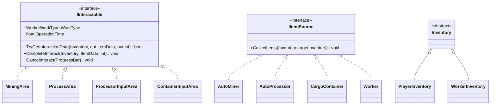
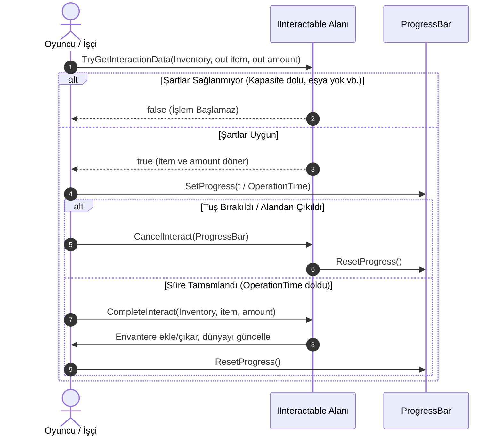

# Temel Arayüzler ve Soyutlamalar (Core Interfaces & Abstractions)

Bu doküman, Mining Tycoon projesindeki sistemler arası etkileşimi, veri transferini ve polimorfik yapıları yöneten temel kontratları (`IInteractable`, `IItemSource`, `Inventory`) detaylandırır.

---

## Genel Bakış ve Mimari Şema

Sistemler arasındaki bağımlılıkları azaltmak (*Decoupling*) ve farklı dünya nesnelerinin ortak davranışlar sergilemesini sağlamak için arayüzler kullanılır.

---

## 1. `IInteractable` (Interactable.cs)

Dünyada zaman harcanarak etkileşime girilen tüm alanların ortak sözleşmesidir.

### Yaşam Döngüsü (Interaction Lifecycle)

### Üyeler ve Sorumluluklar

| Üye | Tip | Açıklama |
|-----|-----|----------|
| `WorkType` | `WorkerWorkType` | Etkileşimin gerektirdiği iş türü (`Mining`, `Processing`, `Operating`, `Transporting`). İşçilerin uygun hedefleri seçmesi için kullanılır. |
| `OperationTime` | `float` | Etkileşimin kaç saniye süreceğini belirler. İlerleme çubuğunun dolma hızını tayin eder. |
| `TryGetInteractionData` | `bool` | Etkileşim başlamadan önce geçerliliği doğrular. Oyuncu/işçi envanterinde yer veya gerekli girdi malzemesi yoksa `false` döner. |
| `CompleteInteract` | `void` | Süre başarıyla dolduğunda çağrılır; eşyayı verir/alır ve asıl dünya mantığını tamamlar. |
| `CancelInteract` | `void` | Etkileşim yarıda kesilirse çağrılır. İlerleme çubuğunu ve geçici bayrakları sıfırlar. |

---

## 2. `IItemSource` (IItemSource.cs)

Bünyesinde eşya depolayan ve bu eşyaları bir aktörün envanterine verebilen tüm kaynakların sözleşmesidir.

### Metot: `CollectItems(Inventory targetInventory)`
* **Çağıranlar:**
  * `CollectItem.cs` (Binaların üzerindeki otomatik toplama trigger alanı)
  * `TransportLogic.cs` (Taşıyıcı işçilerin binalardan eşya yükleme mantığı)
* **Uygulayanlar:**
  * `Building` alt sınıfları (`AutoMiner`, `AutoProcessor`, `CargoContainer`)
  * `Worker` (Başka bir işçiden veya oyuncudan eşya alma)

---

## 3. `Inventory` (Inventory.cs)

Tüm envanter sistemlerinin ata sınıfıdır (`MonoBehaviour`).

* **Amacı:** `IInteractable` ve `IItemSource` gibi sistemlerin somut bir aktör tipi (`PlayerInventory` ya da `WorkerInventory`) yerine genel bir `Inventory` referansı kabul etmesini sağlar.
* **Mevcut Durum:** Şu an için boş bir temel sınıftır (*Marker Base Class*).

---

## Bilinen Sorunlar ve Gelecek İyileştirmeleri

> [!WARNING]
> **1. `CancelInteract(ProgressBar progress)` UI Bağımlılığı:**
> Arayüz içerisinde bir UI bileşeni olan `ProgressBar` doğrudan parametre olarak alınmıştır. Temiz mimaride UI mantığı, işlemi başlatan `PlayerInteraction` / `WorkerInteraction` tarafından yönetilmeli ve bu metot parametresiz (`void CancelInteract()`) olmalıdır.

> [!NOTE]
> **2. Anemik Temel Sınıf ve Downcasting:**
> `Inventory.cs` ortak metotlar sunmadığı için `IItemSource` ve `IInteractable` sınıfları sürekli `if (inventory is PlayerInventory) ... else if (inventory is WorkerInventory)` şeklinde tip sorgulaması yapmak zorunda kalmaktadır. İleriki refactor aşamasında `Inventory` sınıfına `CanAccept()`, `AddItem()`, `RemoveItem()` gibi abstract sözleşmeler eklenmesi bu kod kalabalığını ortadan kaldıracaktır.
