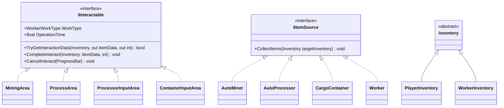
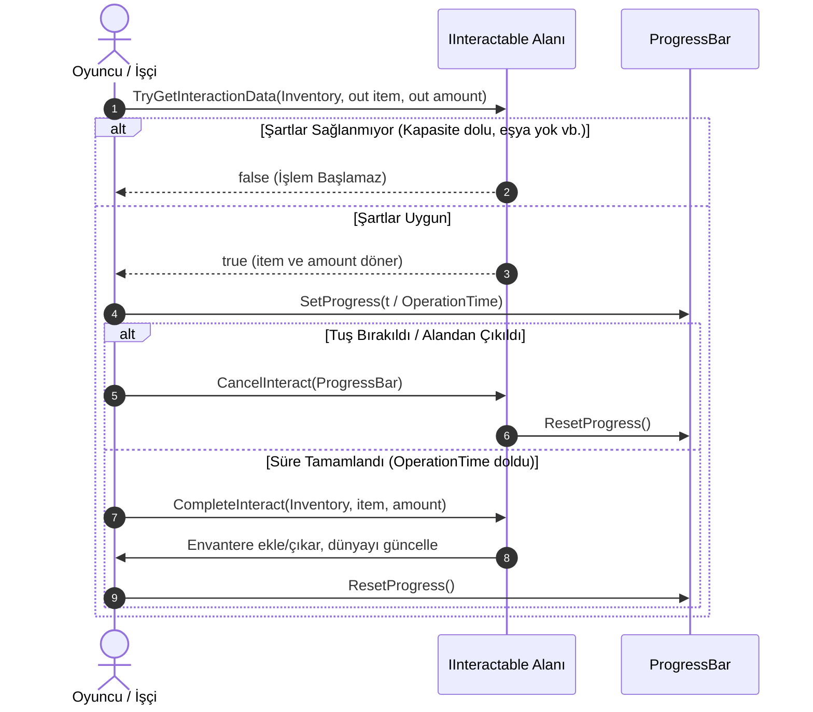

# Temel Arayüzler ve Soyutlamalar (Core Interfaces & Abstractions)

Bu doküman, Mining Tycoon projesindeki sistemler arası etkileşimi, veri transferini ve polimorfik yapıları yöneten temel kontratları (`IInteractable`, `IItemSource`, `Inventory`) detaylandırır.

---

## Genel Bakış ve Mimari Şema

Sistemler arasındaki bağımlılıkları azaltmak (*Decoupling*) ve farklı dünya nesnelerinin ortak davranışlar sergilemesini sağlamak için arayüzler kullanılır.

```mermaid
classDiagram
    class IInteractable {
        <<interface>>
        +WorkerWorkType WorkType
        +float OperationTime
        +TryGetInteractionData(Inventory, out ItemData, out int) bool
        +CompleteInteract(Inventory, ItemData, int) void
        +CancelInteract(ProgressBar) void
    }

    class IItemSource {
        <<interface>>
        +CollectItems(Inventory targetInventory) void
    }

    class Inventory {
        <<abstract>>
    }

    class MiningArea
    class ProcessArea
    class ProcessorInputArea
    class ContainerInputArea

    class AutoMiner
    class AutoProcessor
    class CargoContainer
    class Worker

    class PlayerInventory
    class WorkerInventory

    IInteractable <|.. MiningArea
    IInteractable <|.. ProcessArea
    IInteractable <|.. ProcessorInputArea
    IInteractable <|.. ContainerInputArea

    IItemSource <|.. AutoMiner
    IItemSource <|.. AutoProcessor
    IItemSource <|.. CargoContainer
    IItemSource <|.. Worker

    Inventory <|-- PlayerInventory
    Inventory <|-- WorkerInventory
```

---

## 1. `IInteractable` (IInteractable.cs)

Dünyada zaman harcanarak etkileşime girilen tüm alanların ortak sözleşmesidir.

### Yaşam Döngüsü (Interaction Lifecycle)

```mermaid
sequenceDiagram
    autonumber
    actor Aktör as Oyuncu / İşçi
    participant Alan as IInteractable Alanı
    participant UI as ProgressBar

    Aktör->>Alan: TryGetInteractionData(Inventory, out item, out amount)
    alt Şartlar Sağlanmıyor (Kapasite dolu, eşya yok vb.)
        Alan-->>Aktör: false (İşlem Başlamaz)
    else Şartlar Uygun
        Alan-->>Aktör: true (item ve amount döner)
        Aktör->>UI: SetProgress(t / OperationTime)
        alt Tuş Bırakıldı / Alandan Çıkıldı
            Aktör->>Alan: CancelInteract(ProgressBar)
            Alan->>UI: ResetProgress()
        else Süre Tamamlandı (OperationTime doldu)
            Aktör->>Alan: CompleteInteract(Inventory, item, amount)
            Alan->>Aktör: Envantere ekle/çıkar, dünyayı güncelle
            Aktör->>UI: ResetProgress()
        end
    end
```

### Üyeler ve Sorumluluklar

| Üye | Tip | Açıklama |
|-----|-----|----------|
| `WorkType` | `WorkerWorkType` | Etkileşimin gerektirdiği iş türü (`Mining`, `Processing`, `Operating`, `Transporting`). İşçilerin uygun hedefleri seçmesi için kullanılır. |
| `OperationTime` | `float` | Etkileşimin kaç saniye süreceğini belirler. İlerleme çubuğunun dolma hızını tayin eder. |
| `TryGetInteractionData` | `bool` | Etkileşim başlamadan önce geçerliliği doğrular. Oyuncu/işçi envanterinde yer veya gerekli girdi malzemesi yoksa `false` döner. |
| `CompleteInteract` | `void` | Süre başarıyla dolduğunda çağrılır; eşyayı verir/alır ve asıl dünya mantığını tamamlar. |
| `CancelInteract` | `void` | Etkileşim yarıda kesilirse çağrılır. İlerleme çubuğunu ve geçici bayrakları sıfırlar. |

---

## 2. `IItemSource` (IItemSource.cs)

Bünyesinde eşya depolayan ve bu eşyaları bir aktörün envanterine verebilen tüm kaynakların sözleşmesidir.

### Metot: `CollectItems(Inventory targetInventory)`
* **Çağıranlar:**
  * `ItemOutputArea.cs` (Binaların üzerindeki otomatik toplama trigger alanı)
  * `TransportLogic.cs` (Taşıyıcı işçilerin binalardan eşya yükleme mantığı)
* **Uygulayanlar:**
  * `Building` alt sınıfları (`AutoMiner`, `AutoProcessor`, `CargoContainer`)
  * `Worker` (Başka bir işçiden veya oyuncudan eşya alma)

---

## 3. `Inventory` (Inventory.cs)

Tüm envanter sistemlerinin soyut ata sınıfıdır (`MonoBehaviour`).

* **Amacı:** `IInteractable` ve `IItemSource` gibi sistemlerin somut bir aktör tipi (`PlayerInventory` ya da `WorkerInventory`) yerine genel bir `Inventory` referansı kabul etmesini ve polimorfik eşya transferi yapabilmesini sağlar.
* **Soyut Metotlar:**
  * `public abstract bool CanAccept(InventoryObject item, int amount = 1);`
  * `public abstract int AddItem(InventoryObject item, int amount = 1);`
  * `public abstract int RemoveItem(InventoryObject item, int amount = 1);`
* **Avantajı:** Alanlar ve binalar işlem yaparken `if (inventory is PlayerInventory)` gibi downcasting kontrolleri yapmak zorunda kalmaz.

---

## 4. `IObjectInputManager` (IObjectInputManager.cs)

Dünyaya ızgara tabanlı yerleştirilebilen veya fareyle tıklanarak UI paneli açılabilen sistemlerin (`BuildingManager`, `WorkerManager`) ortak sözleşmesidir.

* `bool IsPlacementMode`: Yerleştirme modunun aktifliğini döner.
* `void UpdatePlacementMode()`: Seçili envanter slotuna göre önizleme modunu günceller.
* `void HandleLeftClick(Vector2 mousePosition)`: Tıklanan noktaya göre yerleştirme veya UI açma sürecini başlatır.
* `void HandlePlaced(Vector3 worldPos, Vector3Int cellPosition)`: Yerleşim onaylandığında nesneyi oluşturup envanterden düşer.
* `void TryOpenUI(Vector2 mousePosition)`: Tıklanan nesnenin arayüzünü açmayı dener.
* `void CancelPlacementMode()`: Yerleşim modunu iptal eder ve önizlemeyi gizler.

---

## Bilinen Sorunlar ve Gelecek İyileştirmeleri

> [!WARNING]
> **`CancelInteract(ProgressBar progress)` UI Bağımlılığı:**
> Arayüz içerisinde bir UI bileşeni olan `ProgressBar` doğrudan parametre olarak alınmıştır. İleride UI mantığı, işlemi başlatan `PlayerInteraction` / `WorkerInteraction` tarafından yönetilerek bu metot parametresiz (`void CancelInteract()`) hale getirilebilir.
