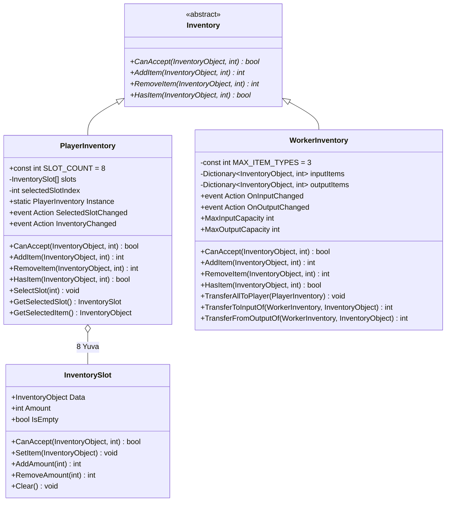
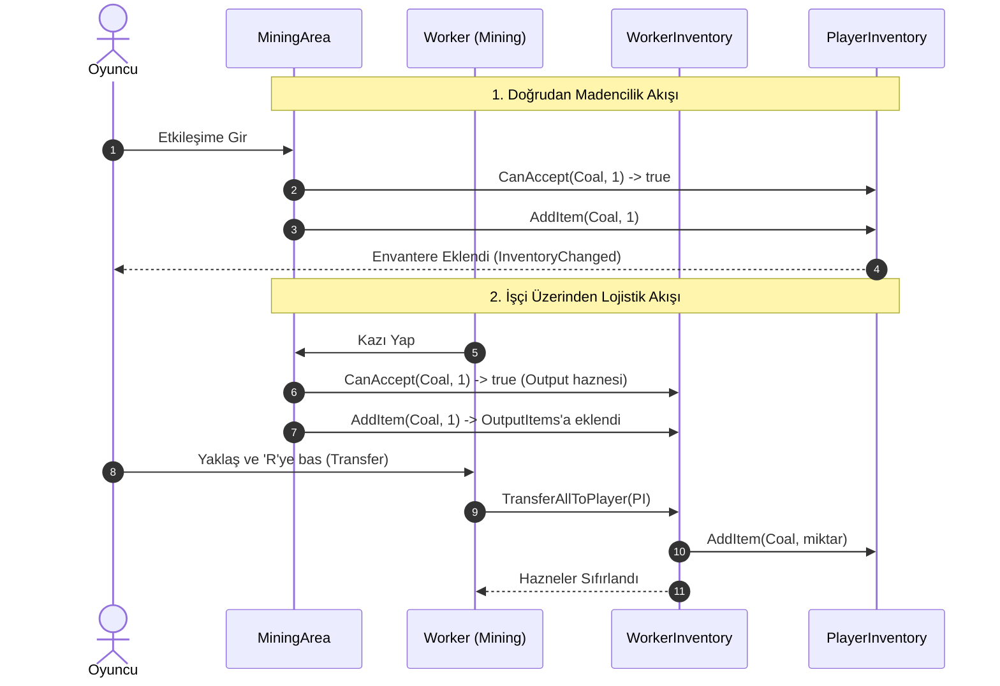

# Envanter Sistemi (Inventory System)

Mining Tycoon projesinde eşyaların depolanmasını, takibini, transferini ve aktörler (Oyuncu & İşçiler) arasındaki lojistik akışını yöneten sistemdir.

---

## Sistem Mimarisi

Envanter sistemi, polimorfik bir `Inventory` temel sınıfı üzerine kuruludur. Oyuncu ve işçiler bu sınıfı miras alarak kendi ihtiyaçlarına uygun depolama modelini sunar.

---

## Bileşenler ve Sorumluluklar

### 1. `Inventory.cs` (Temel Soyutlama)
Tüm envanterlerin ortak arayüzünü tanımlayan abstract sınıftır (`MonoBehaviour`).

* **Sorumlulukları:**
  * `CanAccept(item, amount)`: Envanterin bu eşyayı alıp alamayacağını doğrular.
  * `AddItem(item, amount)`: Eşyayı envantere ekler, eklenen miktarı döner.
  * `RemoveItem(item, amount)`: Eşyayı envanterden eksiltir, eksiltilen miktarı döner.
* **Sağladığı Fayda:** Maden alanları (`MiningArea`), binalar (`AutoMiner`, `AutoProcessor`, `CargoContainer`) gibi dış sistemlerin oyuncu veya işçi ayrımı yapmadan (*Downcasting olmadan*) polimorfik olarak işlem yapmasını sağlar.

---

### 2. `InventorySlot.cs` (Yuva Veri Sınıfı)
Envanterdeki tek bir yuvayı temsil eden saf C# veri sınıfıdır. Kendi iç kurallarını ve tutarlılığını (*Encapsulation*) kendisi korur.

* **Özellikleri:**
  * `Data`: Yuvadaki eşya (`InventoryObject`).
  * `Amount`: Yuvadaki mevcut miktar.
  * `IsEmpty`: Slotun boş olup olmadığını (`Data == null || Amount <= 0`) bildirir.
* **Akıllı Davranışlar:**
  * **Otomatik Temizleme (Self-Cleaning):** `RemoveAmount(amount)` çağrıldığında miktar 0 veya altına inerse slot otomatik olarak `Clear()` çağırır.
  * **Negatiflik Koruması:** Miktar hiçbir zaman sıfırın altına düşmez.

---

### 3. `PlayerInventory.cs` (Oyuncu Envanteri & Hotbar)
Oyuncunun 8 yuvalık hotbar'ını yöneten `Singleton` bileşendir.

* **Özellikleri:**
  * `SLOT_COUNT = 8`: Sabit yuva sayısı.
  * `SelectedSlotChanged`: Oyuncu farklı bir slot seçtiğinde (tıklama veya klavye) tetiklenir.
  * `InventoryChanged`: Eşya miktarı veya türü değiştiğinde UI'ı güncellemek üzere tetiklenir.
* **Eşya Ekleme Mantığı:**
  1. Önce aynı eşyaya sahip mevcut bir slot aranır, varsa üzerine eklenir.
  2. Yoksa ilk boş slot (`slot.IsEmpty`) bulunup eşya oraya atanır.
  3. Yer yoksa `0` döner ve konsola uyarı basar.

---

### 4. `WorkerInventory.cs` (İşçi Envanteri)
İşçiler için çift hazneli (**Input** ve **Output**) dinamik bir depolama sistemidir.

* **Dinamik Kapasite Dağılımı (`WorkerWorkType`):**
  * **Mining (Madencilik):** Sadece `Output` aktiftir (Çıkarılan madenler burada birikir).
  * **Operating (Operatörlük):** Sadece `Input` aktiftir (Makinelere beslenecek hammaddeler taşınır).
  * **Processing (İşleme):** Kapasite yarı yarıya bölünür (Input: hammadde, Output: işlenmiş ürün).
  * **Transporting (Taşıma):** `Output` haznesinde kargo taşınır.
* **Ortak Kontrat Uyumu:**
  * `AddItem`: İşçinin rolüne göre eşyayı otomatik olarak doğru hazneye yönlendirir.
  * `RemoveItem`: Operatör işçide öncelikle `Input` haznesinden, diğer işçilerde ise `Output` haznesinden eksiltir.
* **Lojistik Metotları:**
  * `TransferAllToPlayer(PlayerInventory)`: İşçinin tüm envanterini oyuncuya boşaltır.
  * `TransferToInputOf(WorkerInventory, item)`: Başka bir işçinin Input haznesine eşya aktarır.
  * `TransferFromOutputOf(WorkerInventory, item)`: Başka bir işçinin Output haznesinden eşya çeker.

---

## Eşya Akış Diyagramı (Lojistik Örneği)

   