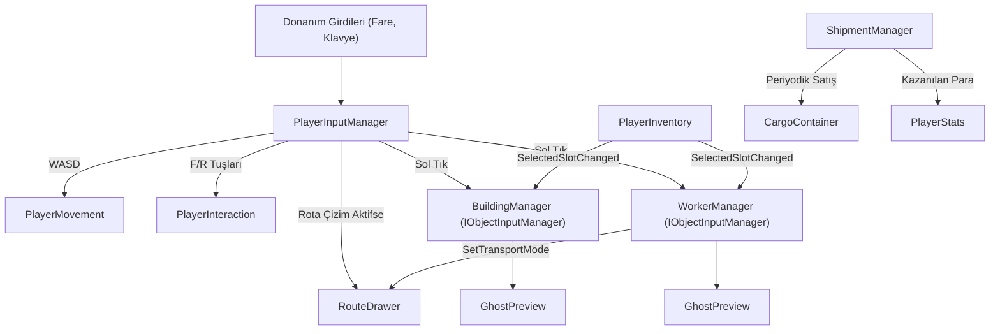

# Yönetici Sistemleri (Managers System)

Mining Tycoon projesinde oyuncu girdilerini yakalayan, binaları ve işçileri ızgara tabanlı yerleştiren, taşıma rotalarını çizen ve konteyner satış döngülerini koordine eden üst düzey orkestrasyon katmanıdır.

---

## Sistem Mimarisi

Yönetici katmanı donanım girdilerini merkezi olarak toplar ve ilgili alt sistemlere yönlendirir:

---

## Bileşen Detayları

### 1. `PlayerInputManager.cs` (Merkezi Girdi Yöneticisi)
* **Tek Donanım Kapısı:** `Input.GetKey`, `Input.GetAxisRaw` ve `Input.GetMouseButton` gibi donanım çağrılarını tek bir merkezde toplar.
* **Önbelleklenmiş Kamera:** `Camera.main` sorgusunu önbelleğe alarak her karede `MouseWorldPosition` hesaplar. Diğer tüm scriptler dünya koordinatını buradan okur.
* **Trafik Kontrolü:** 
  * UI üzerine tıklandığında (`EventSystem.current.IsPointerOverGameObject()`) dünya tıklamalarını yutar.
  * `RouteDrawer` aktifse fare tıklama ve sürükleme aksiyonlarını doğrudan ona iletir; bina ve işçi tıklamalarını kilitler.

---

### 2. `IObjectInputManager.cs` (Nesne Girdi ve Yerleşim Arayüzü)
Sahneye yerleştirilebilir ve fareyle etkileşime geçilebilir nesne yöneticilerinin (`BuildingManager`, `WorkerManager`) ortak sözleşmesidir:
* `bool IsPlacementMode`: Yerleştirme modunun aktifliğini bildirir.
* `void UpdatePlacementMode()`: Seçili envanter slotuna göre modu açar veya kapatır.
* `void HandleLeftClick(Vector2 mousePosition)`: Tıklamayı yerleştirme veya UI paneli açmaya yönlendirir.
* `void HandlePlaced(Vector3 worldPos, Vector3Int cellPosition)`: Yerleşim onaylandığında nesneyi sahnede oluşturur ve envanterden eksiltir.
* `void TryOpenUI(Vector2 mousePosition)`: Tıklanan nesnenin kullanıcı arayüzünü açar.
* `void CancelPlacementMode()`: Yerleştirme modunu iptal edip önizlemeyi gizler.

---

### 3. `GhostPreview.cs` (Bağımsız Hayalet Önizleme Bileşeni)
* **Yeniden Kullanılabilirlik:** Hem binalar hem de işçiler aynı bileşeni kullanır.
* **Donanım Bağımsızlığı:** İçinde hiçbir `Input` veya `Camera.main` barındırmaz; pozisyonu dışarıdan `UpdatePreview(Vector2 mouseWorldPosition)` ile alır.
* **Doğrulama:** `Physics2D.OverlapBox` ile engelleri (`blockerLayer`) ve zorunlu alan katmanını (`fineLayer`) kontrol ederek hayaleti kırmızı veya yeşil renklendirir.
* **Yerleşim Onayı:** Konum uygunsa `OnPlacementConfirmed` olayını fırlatır.

---

### 4. `BuildingManager.cs` (Bina Yöneticisi)
* `IObjectInputManager` arayüzünü uygular.
* `PlayerInventory` üzerinde `BuildingData` seçildiğinde `GhostPreview` üzerinden inşaat modunu başlatır.
* Yerleşim onaylandığında prefabı oluşturur, `NodeMaker` üzerinde binanın kapladığı hücreleri yürünemez (`isWalkable = false`) yapar ve envanterden 1 adet bina düşer.
* Tıklanan noktada bina varsa `BuildingUIManager` üzerinden panelini açar.

---

### 5. `WorkerManager.cs` (İşçi Yöneticisi)
* `IObjectInputManager` arayüzünü uygular.
* `PlayerInventory` üzerinde `WorkerData` seçildiğinde işçi hayaletini açar; yerleştirildiğinde işçiyi sahnede oluşturur (işçiler `NodeMaker` kapatmaz).
* **İşe Yönlendirme:** `SetMoveWorkerMode(true)` aktifken tıklanan çalışma alanını (`workableLayer`) doğrular ve işçiyi A* rotasıyla oraya gönderir (`TryMoveToWork`).
* **Taşıma Modu:** `SetTransportMode` ile işçiyi ve taşınacak eşyayı alıp `RouteDrawer`'ı başlatır.
* **Envanter Temizliği:** İşçiye yeni bir görev verildiğinde üzerindeki ürünleri otomatik olarak `PlayerInventory`'ye aktarır (`TransferWorkerInventoryToPlayer`).

---

### 6. `ShipmentManager.cs` (Sevkiyat ve Satış Zamanlayıcısı)
* **Kayıt Deseni:** Sahnedeki `CargoContainer` bileşenleri `OnEnable` ve `OnDisable` anında statik `Register`/`Unregister` metodlarıyla listeye kaydolur.
* **Periyodik Satış:** Belirlenen aralıklarla (`shipmentInterval`, varsayılan 30 sn) tüm konteynerlerin içindeki ürünleri satar (`SellAndClearAll`).
* **Kazanç:** Elde edilen toplam parayı `PlayerStats.Instance`'a ekler ve `OnShipmentCompleted` event'ini tetikler.
* **Bellek Güvenliği:** `OnDestroy` içinde statik listeyi temizleyerek sahne geçişlerinde referans sızıntılarını önler.

---

### 7. `RouteDrawer.cs` (Rota Çizim Sistemi)
* **`Update()` İçermez:** Donanım sorgulaması yapmaz; tüm girdileri `PlayerInputManager`'dan alır:
  * `HandlePointerDown(worldPos)`: Çizimi başlatır.
  * `HandlePointerDrag(worldPos)`: Sürükleme boyunca yürünebilir komşu hücreleri Manhattan interpolasyonu ile rotaya ekler.
  * `HandlePointerUp()`: Çizimi tamamlar ve callback fırlatır.
  * `CancelDrawing()`: Çizimi iptal eder.
* **Görselleştirme:** Hücreleri `LineRenderer` ile `Z = -1f` derinliğinde tilemap'in önünde çizer.

---

### 8. `StartingGame.cs` (Başlangıç ve Test Envanteri)
* `BuildingManager`'dan ayrıştırılmış özel bileşendir.
* Inspector üzerinden dinamik bir liste (`StartingItem`) olarak tanımlanır.
* Oyun başladığında belirlenen eşya, bina veya işçileri istenen adette `PlayerInventory`'ye aktarır.
* `targetFrameRate` (120 FPS) ayarını merkezi olarak yönetir.
