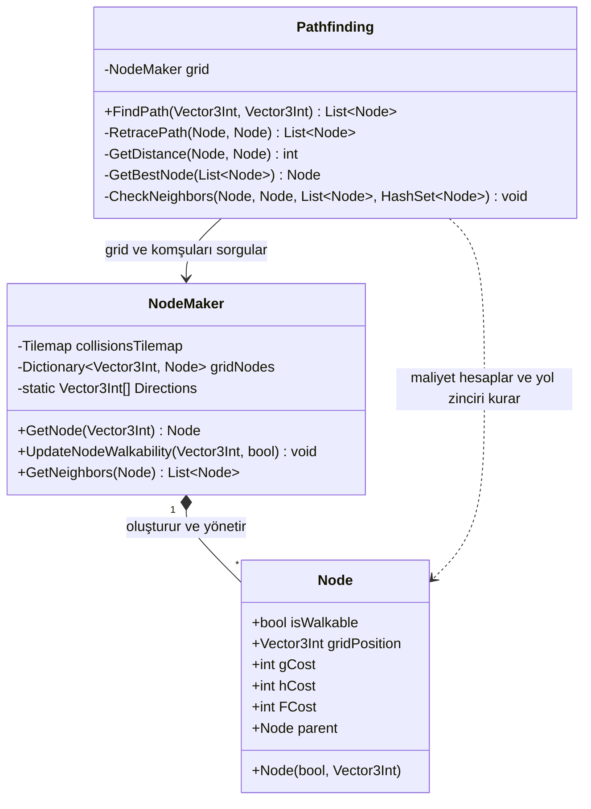
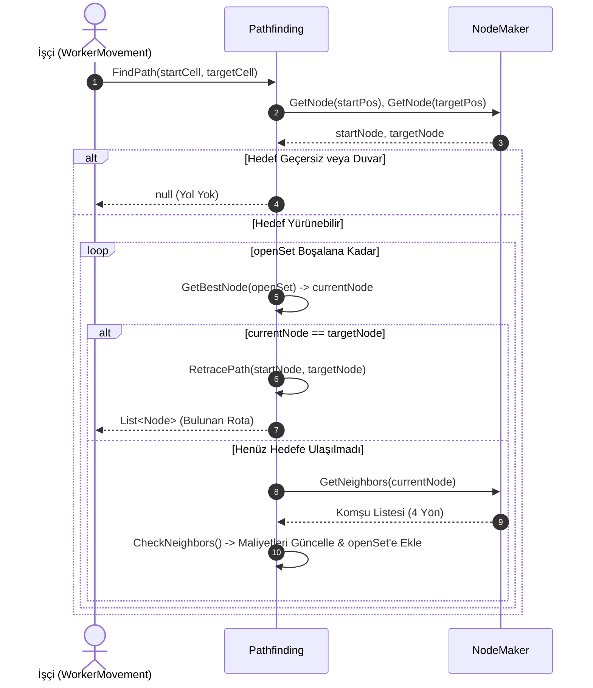

# Yol Bulma Sistemi (Pathfinding System)

Mining Tycoon projesinde işçilerin (`Worker`, `TransportMovement`) harita üzerinde en kısa ve engelsiz yolu bularak madenlere, fırınlara ve depolama konteynerlerine otonom şekilde ulaşmasını sağlayan A* (A-Star) navigasyon sistemidir.

---

## Sistem Mimarisi

Yol bulma sistemi 3 temel parçadan oluşur:
1. **`Node`**: Izgara üzerindeki tek bir hücrenin veri modelidir (pozisyon, yürünebilirlik, maliyetler).
2. **`NodeMaker`**: Sahnedeki `Tilemap` çarpışma sınırlarını tarayarak haritayı hücrelere bölen ve komşulukları yöneten sınıftır.
3. **`Pathfinding`**: İki hücre koordinatı arasında Manhattan mesafesi sezgiseliyle en kısa yolu hesaplayan algoritma motorudur.

---

## Bileşen Detayları

### 1. `Node.cs` (Izgara Hücresi)
`MonoBehaviour` içermeyen saf (pure) bir C# veri yapısıdır.
* **Hafif Bellek Yapısı:** Binlerce hücre oluşturulsa dahi Unity GameObject yükü oluşturmaz.
* **Yürünebilirlik (`isWalkable`):** Çarpışma tilemap'inde engel olmayan hücreler `true` olarak işaretlenir. Haritaya bina inşa edildiğinde dinamik olarak `false` yapılır.
* **A* Maliyetleri:**
  * `gCost`: Başlangıç hücresinden bu hücreye kadar katedilen gerçek adım sayısı.
  * `hCost`: Hedefe olan tahmini Manhattan mesafesi (sezgisel).
  * `FCost`: Toplam maliyet ($F = G + H$). Algoritma daima $F$ maliyeti en düşük hücreyi önceliklendirir.
* **Geriye Takip (`parent`):** Hedefe ulaşıldığında başlangıç noktasına kadar olan rotayı çıkarmak için gelinen önceki hücre referansını tutar.

---

### 2. `NodeMaker.cs` (Izgara Yöneticisi)
Haritanın koordinat sistemini ve komşuluk ilişkilerini kurar.
* **Otomatik Tarama (`CreateGrid`):** `Awake` anında `collisionsTilemap.cellBounds` alanını tarar. Tile bulunmayan kareleri yürünebilir (`isWalkable = true`), tile bulunan kareleri engel olarak kaydeder.
* **Hafıza Optimizasyonu:** Komşu sorgularında (`GetNeighbors`) sürekli yeni yön dizisi oluşturulmaması için 4 ana yön (`Directions`) statik bir dizi olarak önceden belleğe alınmıştır.
* **Dinamik Engel Güncellemesi (`UpdateNodeWalkability`):** `BuildingManager` bir bina yerleştirdiğinde ilgili hücreleri `isWalkable = false` yaparak işçilerin binaların içinden geçmesini engeller.

---

### 3. `Pathfinding.cs` (A* Arama Algoritması)
İki ızgara hücresi arasındaki en kısa yolu hesaplar.
* **Açık Küme (`openSet`):** İncelenmeye aday hücrelerin listesidir. Her adımda $F$ maliyeti en düşük hücre seçilir (`GetBestNode`).
* **Kapalı Küme (`closedSet`):** Ziyaret edilmiş ve komşuları taranmış hücrelerin kümesidir (`HashSet<Node>`). Tekrar incelenmelerini önler.
* **Manhattan Mesafesi (`GetDistance`):** 4 yönlü (çapraz olmayan) ızgara hareketinde gerçek adım mesafesini yansıtır:
  $$\text{Mesafe} = |x_1 - x_2| + |y_1 - y_2|$$
* **Rotanın Oluşturulması (`RetracePath`):** Hedef hücreden başlayarak `parent` işaretçilerini geriye doğru takip eder, listeyi tersine çevirerek (`Reverse`) başlangıçtan hedefe doğru sıralı bir rota listesi döner.

---

## Yol Bulma Yaşam Döngüsü (A* Search Lifecycle)

---

## Tasarım Notları ve Stabilite

1. **Sabit Maliyet Güvenliği:**
   Haritada her adım maliyeti sabit `+1` olduğu için, A* algoritması arama önceliğini hiçbir zaman şaşırmaz.
2. **Çöp Bellek (GC) Azaltımı:**
   Yön vektörleri statik tutularak her komşu sorgusundaki gereksiz array tahsisleri sıfırlanmıştır.
3. **Tek Sorgulu Sözlük Erişimi:**
   `gridNodes` aramalarında `ContainsKey` + `indexer` çift sorgusu yerine tek `TryGetValue` kullanılarak işlemci çevrimleri korunmuştur.
