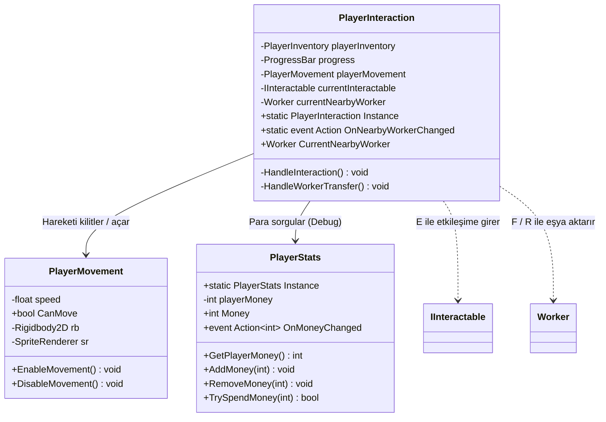
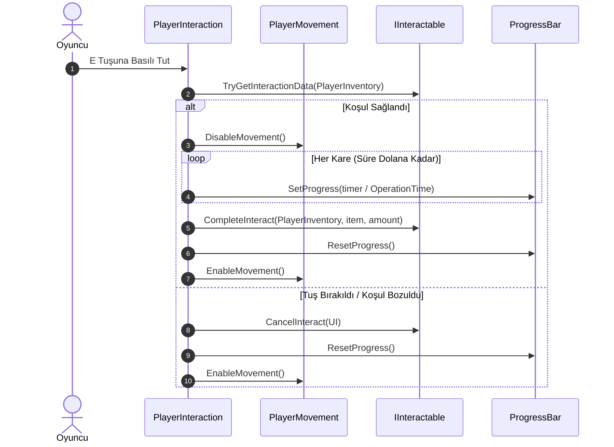

# Oyuncu Sistemleri (Player Systems)

Mining Tycoon projesinde oyuncunun fiziksel hareketini, dünyadaki etkileşim alanlarıyla (madenler, işleme makineleri, depolama konteynerleri) olan bağını ve oyuncu ekonomisini yöneten temel sistemlerdir.

---

## Sistem Mimarisi

Oyuncu sistemleri 3 ana bileşenden oluşur ve `PlayerInventory` ile doğrudan entegre çalışır:

---

## Bileşenler ve Sorumluluklar

### 1. `PlayerMovement.cs`
Oyuncunun 2D yukarıdan bakış (Top-Down) hareketini ve yönelimini yönetir.

* **Fizik Entegrasyonu:** Unity 6'nın yeni `rb.linearVelocity` API'si üzerinden fizik hızını uygular.
* **Girdi Toplama:** `Update` içinde `Horizontal` ve `Vertical` eksenlerini okur; hareket yönüne göre sprite'ı yatayda aynalar (`sr.flipX`).
* **Hareket Kilidi:**
  * `DisableMovement()`: Oyuncu bir maden kazarken veya makine çalıştırırken hareketi dondurur (`linearVelocity = Vector2.zero`).
  * `EnableMovement()`: Etkileşim bittiğinde veya iptal edildiğinde oyuncunun yeniden serbestçe hareket etmesini sağlar.

---

### 2. `PlayerInteraction.cs`
Oyuncunun çevresindeki etkileşim noktalarını algılayan ve klavye girdilerine göre aksiyonları yürüten merkez bileşendir (`Singleton`).

* **Algılama (Trigger):**
  * `IInteractable`: Yaklaşılan maden alanı, işleme alanı veya konteyner girdi alanını yakalar.
  * `Worker`: Yaklaşılan işçiyi yakalar ve `OnNearbyWorkerChanged` event'ini tetikler (UI butonlarının açılıp kapanmasını sağlar).
* **Zamanlı Etkileşim (`E` Tuşu):**
  * `currentInteractable.TryGetInteractionData()` ile oyuncunun envanterinde bu etkileşim için gerekli şartların varlığını doğrular.
  * Oyuncunun hareketini kilitler, `ProgressBar` üzerinde ilerlemeyi doldurur.
  * Süre (`OperationTime`) dolduğunda `CompleteInteract()` çağrılarak işlem tamamlanır.
  * Tuş bırakılırsa veya etkileşim koşulu bozulursa `CancelInteract()` çağrılarak ilerleme sıfırlanır ve hareket açılır.
* **İşçi Eşya Transferi (`F` ve `R` Tuşları):**
  * **`F` Tuşu:** Oyuncunun seçili hotbar slotundaki eşyayı yakındaki işçinin `Input` haznesine aktarır (`AddToInput`).
  * **`R` Tuşu:** Yakındaki işçinin `Input` haznesindeki tüm eşyaları oyuncunun envanterine geri aktarır (`ClearInput`).

---

### 3. `PlayerStats.cs`
Oyuncunun kasasındaki parayı ve satın alma işlemlerini yöneten `Singleton` bileşendir.

* **Bakiye Takibi (`Money`):**
  * `AddMoney(amount)`: Satışlardan veya sevkiyatlardan elde edilen geliri kasaya ekler.
  * `RemoveMoney(amount)`: Bakiye düşüşlerinde eksiye inmesini engeller (`Mathf.Max(0, ...)`).
  * `TrySpendMoney(amount)`: Yeterli para varsa harcamayı tek adımda gerçekleştirir ve `true` döner (bina alımları veya işçi yükseltmeleri için idealdir).
* **Event Odaklı Yapı (`OnMoneyChanged`):**
  * Para miktarı her değiştiğinde bu event tetiklenir. Böylece UI'lar her karede parayı kontrol etmek (polling) zorunda kalmaz; yalnızca bu event'i dinleyerek ekranı günceller.

---

## Etkileşim Akış Diyagramı

