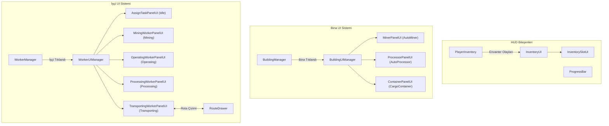

# Kullanıcı Arayüzü Katmanı (UI Layer)

Mining Tycoon projesinde oyuncu envanterini, binaların üretim ve depolama durumlarını, işçilerin görev atamalarını, envanter transferlerini ve geliştirme süreçlerini yöneten kullanıcı arayüzü mimarisidir.

---

## Sistem Mimarisi

UI katmanı, veri üreten ve yöneten sistemleri (`PlayerInventory`, `Building`, `Worker`) dinleyerek olay tabanlı (event-driven) çalışır:

---

## Bileşen Detayları

### 1. Genel UI Elemanları

#### `ProgressBar.cs` (İlerleme Çubuğu)
* **Korumalı Aralık:** `SetProgress(float progress)` metodu `Mathf.Clamp01` ile korunarak görsel taşmalar önlenir.
* **Kullanım:** Binaların (`AutoMiner`, `AutoProcessor`) ve işçilerin üretim döngülerindeki anlık ilerlemeyi `Image.fillAmount` üzerinden görselleştirir.

#### `InventorySlotUI.cs` & `InventoryUI.cs` (Oyuncu Envanter Arayüzü)
* **Dinamik Boyutlandırma:** `InventoryUI`, sahneye baştan sabit slot dizmek yerine `PlayerInventory` üzerindeki slot adedi kadar dinamik olarak `InventorySlotUI` üretir.
* **Görsel Seçim:** Tıklanan slotun etrafına seçim çerçevesi (`selectionBorder`) yerleştirilir.
* **Bellek Güvenliği:** `PlayerInventory.Instance.InventoryChanged` ve `SelectedSlotChanged` abonelikleri `OnDestroy` içinde temizlenerek sahne geçişlerinde bellek sızıntıları engellenir.

---

### 2. Bina Arayüzleri (Building UI)

#### `BuildingUIManager.cs` (Bina Paneli Yönlendiricisi)
* Tıklanan bina nesnesinin somut türüne (`AutoMiner`, `AutoProcessor`, `CargoContainer`) göre uygun UI panelini açar.
* Tüm bina panellerini tek merkezden (`CloseAllPanels()`) kapatabilme imkanı sunar.

#### `MinerPanelUI.cs` (Maden Paneli)
* **Olay Tabanlı Güncelleme:** `AutoMiner.OnStorageChanged` olayını dinleyerek sadece üretim yapıldığında veya ürün toplandığında metinleri yeniler; her karede string üretimi yapmaz.
* **Canlı Animasyon:** `Update()` içinde sadece üretim ilerleme çubuğu (`ProgressBar`) güncellenir.

#### `ProcessorPanelUI.cs` (İşleme Tesisi Paneli)
* **Girdi/Çıktı Takibi:** İşleme tesisinin hem girdi deposunu hem de işlenmiş ürün haznesini eşzamanlı gösterir.
* **Üretim Döngüsü:** `AutoProcessor.OnProcessComplete` ile ürün tamamlandığında arayüzü anında tazeler.

#### `ContainerPanelUI.cs` (Sevkiyat Konteyneri Paneli)
* Konteyner içindeki toplam ürün adedini, kapasiteyi ve sevkiyata kalan süreyi gösterir.
* Konteyner seviye ve kapasite artırım butonlarını yönetir.

---

### 3. İşçi Arayüzleri (Worker UI)

#### `WorkerUIManager.cs` (İşçi Paneli Yönlendiricisi)
* İşçinin `CurrentState` (`Idle`, `Working`, `Transporting`) ve `CurrentWorkType` (`Mining`, `Operating`, `Processing`) durumlarına göre doğru paneli açar.
* Güvenli null kontrolleri ile geçersiz işçi seçimlerinde panelleri otomatik kapatır.

#### `AssignTaskPanelUI.cs` (Görev Atama Paneli)
* Boştaki (`Idle`) işçinin özelliklerini (Seviye, Kazma Hızı, Hareket Hızı) gösterir.
* **İşe Gönderme:** "Çalış" butonu ile `WorkerManager.SetMoveWorkerMode(true)` tetiklenir.
* **Taşıma Rotası:** "Taşı" butonu ile `TransportingWorkerPanelUI.OpenForSetup()` çağrılarak rota sihirbazı başlatılır.
* **Parametresiz Yükseltmeler:** Sabit sayılar yerine işçinin kendi maliyetlerini kullanan `TryUpgradeMiningSpeed()` ve `TryUpgradeMovementSpeed()` çağrılarını yürütür.

#### `MiningWorkerPanelUI.cs` (Maden İşçisi Paneli)
* Maden kazan işçinin çıktı haznesini, kapasitesini ve çalışma durumunu gösterir.
* "Durdur" butonuyla işçiyi `StopWorking()` moduna geçirip görev atama paneline aktarır.

#### `OperatingWorkerPanelUI.cs` (Bina İşleten İşçi Paneli)
* Bina işleten işçinin girdi haznesini gösterir.
* **Menzil Kontrolü:** `PlayerInteraction.OnNearbyWorkerChanged` event'i ile oyuncu işçinin yanındaysa "Girdi Ekle" ve "Girdiyi Geri Al" butonlarını aktif hale getirir.

#### `ProcessingWorkerPanelUI.cs` (İşleme İşçisi Paneli)
* İşleme yapan işçinin çoklu girdi ve çıktı yuvalarını ikon ve adetleriyle listeler.
* Oyuncunun yakınlığına göre girdi aktarım ve tahliye işlemlerini yürütür.

#### `TransportingWorkerPanelUI.cs` (Taşıyıcı İşçi Paneli)
* **Çift Modlu Yapı:**
  1. `OpenForSetup()`: İşçiye oyuncu envanterinden taşınacak eşya seçtirir ve harita üzerinde `RouteDrawer` ile rota çizim modunu devreye sokar.
  2. `Open()`: Çalışmakta olan taşıyıcı işçinin rotasını haritada `RouteDrawer.ShowRoute()` ile görselleştirir ve taşınan yük durumunu raporlar.
* Panelin kapatılmasıyla (`Close`) veya nesnenin yok edilmesiyle (`OnDestroy`) rota çizimi otomatik gizlenir ve tüm event dinleyicileri temizlenir.

---

## Tasarım İlkeleri & Kararlar

1. **Olay Tabanlı Mimari:** UI panelleri her karede (`Update`) veri tabanını yoklamak yerine, domain nesnelerinin fırlattığı event'lere abone olur. `Update()` metotları yalnızca yumuşak ilerleme çubuğu animasyonları için kullanılır.
2. **Hafıza Sızıntısı Önleme:** Tüm paneller `OnDestroy()` yaşam döngüsünde event aboneliklerini (`-=`) temizler.
3. **Parametresiz Yetenek Geliştirme:** İşçi geliştirme butonları arayüz katmanında sabit sayı (`500`) barındırmaz; modelin (`Worker`) kendi maliyet ve artış kurallarını yürütür.
4. **Pragmatik Yönlendirme:** 3 bina ve 5 işçi durumuna sahip oyun kapsamında, gereksiz soyutlama ve fabrika sınıfları yerine okunabilir ve performanslı switch blokları tercih edilmiştir.
