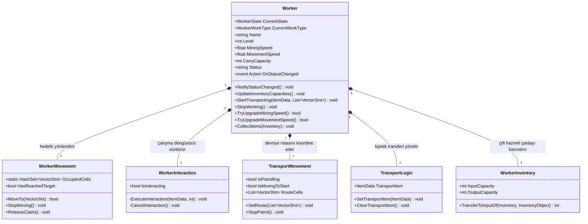
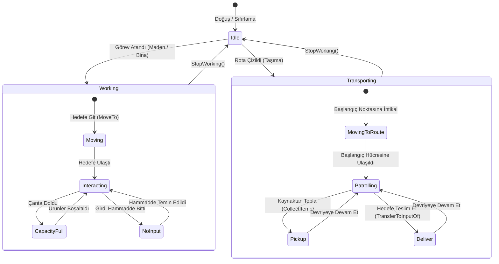

# İşçi Sistemi (Worker System)

Mining Tycoon projesinde otonom işçi yapay zekasını, durum makinesini (`WorkerState`, `WorkerWorkType`), navigasyonu, alan etkileşimini ve lojistik taşıma mekanizmalarını yöneten modüler sistemdir.

---

## Sistem Mimarisi

İşçi sistemi, "Tek Sorumluluk Prensibi" (Single Responsibility) doğrultusunda ayrıştırılmış 5 temel bileşenden oluşur:



---

## Durum Makinesi (State Machine)

İşçiler 3 ana yaşam döngüsü durumuna (`WorkerState`) ve çalışma anında 3 aktif iş türüne (`WorkerWorkType`) sahiptir:



---

## Bileşen Detayları

### 1. `Worker.cs` (Merkezi Orkestratör)
İşçinin kimliğini, istatistiklerini, durumunu ve geliştirmelerini yöneten ana bileşendir.
* **Durum Bildirimi (`Status` & `OnStatusChanged`):** UI panelleri sürekli `Update` içinde sorgu yapmak yerine olay tabanlı (event-driven) çalışır. İşçinin durumu değiştiğinde `NotifyStatusChanged()` açık olan panel arayüzünü günceller.
* **Geliştirme Ayarları (`[Header("Upgrade Settings")]`):**
  * `TryUpgradeMiningSpeed()` ve `TryUpgradeMovementSpeed()` parametresiz aşırı yüklemeleri (overload) ile Unity Inspector buton OnClick olaylarına doğrudan bağlanabilir.
  * Harcama işlemi `PlayerStats.Instance.TrySpendMoney(cost)` ile atomik ve güvenli yapılır.
* **Kayıpsız Eşya Aktarımı (`CollectItems`):**
  * Oyuncu işçiden maden toplarken çantasında yer kalmadığında eşyaların silinmesini önler. Sadece eklenen miktar (`added`) kadarını işçinin çıkışından düşer (`RemoveFromOutput`).
  * İki taşıyıcının birbirinden eşya çalmasını engelleyen koruma kalkanlarına sahiptir.

### 2. `WorkerMovement.cs` (Grid & A* Navigasyonu)
İşçinin maden damarlarına veya binalara tekil hücre hedefli yürümesini yönetir.
* **Oto-Bağlantı:** `Start()` anında sahnedeki `Pathfinding.Instance` üzerinden yol bulucu ve grid referanslarını otomatik çözer; Inspector'dan manuel referans taşıma yükünü kaldırır.
* **Hücre Rezervasyonu (`OccupiedCells`):** Birden fazla işçinin aynı kareye gidip üst üste çakışmasını engellemek için statik bir `HashSet` kullanır.
* **Kilitlenme Önleme:** İşçi sahneden yok edildiğinde (`OnDestroy`) veya durdurulduğunda (`StopMoving`), rezerve ettiği hücreyi `ReleaseClaim()` ile boşa çıkarır. Böylece harita hücreleri kalıcı olarak kilitlenmez.

### 3. `WorkerInteraction.cs` (Sürekli Alan Etkileşimi)
İşçi hedefe vardığında `IInteractable` (MiningArea, ProcessArea, MachineOperatingArea) ile zamanlayıcı tabanlı üretim döngüsünü işletir.
* **`IsInteracting` Kapsülleme (Encapsulation):**
  ```csharp
  public bool IsInteracting
  {
      get => isInteracting;
      private set
      {
          if (isInteracting == value) return;
          isInteracting = value;
          if (worker != null) worker.NotifyStatusChanged();
      }
  }
  ```
  Değer değiştiğinde otomatik olarak UI'ı uyarır; her frame gereksiz event tetiklenmesini önler.
* **Yardımcı Metotlar:** İşlemleri ilerleten `ExecuteInteraction()` ve kesildiğinde barı/zamanlayıcıyı sıfırlayan `CancelInteraction()` sorumlulukları ayrıştırılmıştır.

### 4. `TransportMovement.cs` (Ping-Pong Rota Devriyesi)
Taşıyıcı işçinin oyuncunun çizdiği rota çizgisi üzerinde sürekli git-gel devriye atmasını sağlar.
* **Oto-Bağlantı:** `Start()` anında `Pathfinding.Instance` ve `Pathfinding.Instance.Grid` referanslarını otomatik çözer.
* **İki Aşamalı Hareket:**
  1. *Başlangıca İntikal:* İşçi rotanın ilk hücresinde değilse A* ile rotanın 0. noktasına yürür (`isMovingToStart = true`).
  2. *Ping-Pong Devriye:* Rotanın başına varıldığında `direction = +1 / -1` ile uç noktalar arasında gidip gelir (`AdvanceToNextWaypoint`).
* **`MoveTowards` Birleştirmesi:** Hareket ve mesafe tolerans kontrolü tek bir yardımcı fonksiyonda toplanarak kod tekrarı ortadan kaldırılmıştır.

### 5. `TransportLogic.cs` (Lojistik Fizik Tetikleyicisi)
Taşıyıcı işçinin rotada yürürken 2D Trigger çarpışmaları ile otomatik malzeme alıp vermesini sağlar.
* **Erken Katman Filtresi:** Çarpışmalarda sadece `Layer 9 (Worker)` ve `Layer 6 (Building)` katmanları işlenir; harita/zemin/çevre collider'larında sıfır `GetComponent` maliyetiyle anında çıkış yapılır.
* **Girdiye Boşaltma (Layer 9):** Çarptığı aktör bir işçi ise ve taşıyıcı değilse malı onun girdi haznesine teslim eder (`inventory.TransferToInputOf`) ve hemen çıkar (aynı işçiden eşya çalma ve çift arama bug'ı engellendi).
* **Kaynaktan Toplama (Layer 6):** Çarptığı nesne bir bina kaynağı ise (`IItemSource`) eşyayı sırtına yükler (`source.CollectItems(inventory)`).
* **Güvenlik Kalkanı:** İki taşıyıcının birbirinin yükünü çalmasını ve sonsuz döngüye girmesini engeller.

---

## Yapılan İyileştirmeler ve Çözülen Hatalar (Faz 8 Özeti)

1. **CS0108 Derleme Uyarısı:** `Worker.name` gizlemesi `[SerializeField] private new string name = ""` ile çözüldü.
2. **Kritik Hücre Kilitlenmesi:** `WorkerMovement` sınıfına `OnDestroy() { ReleaseClaim(); }` ve `StopMoving` serbest bırakması eklenerek maden karelerinin kilitli kalması önlendi.
3. **Eşya Kaybı Önleme:** `Worker.CollectItems` içindeki `ClearOutput()` hatası yerine oyuncunun gerçek alabildiği miktar kadar silme (`RemoveFromOutput`) sağlandı.
4. **Polimorfik Aktarım:** `TransferToInputOf` ve `CollectItems` metodlarında gereksiz tip zorlamaları (`is PlayerInventory`, `is WorkerInventory`) kaldırılarak saf `Inventory` temel sınıfı kontratına geçildi.
5. **Kod Sadeleştirme:** `WorkerInteraction` ve `TransportMovement` içindeki mükerrer `MoveTowards` ve `Cancel` blokları modüler yardımcı metodlara taşındı.
